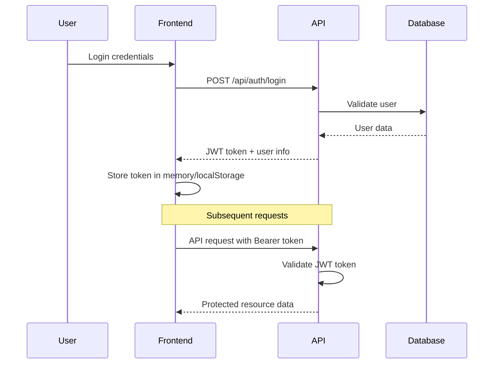
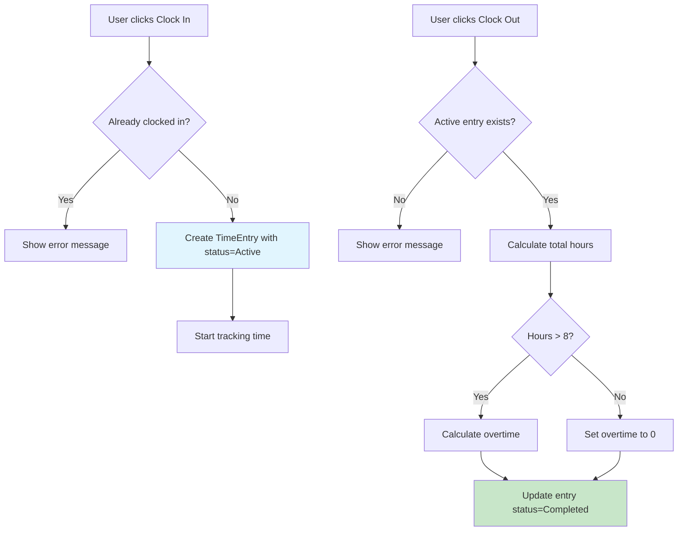

# Oxigin Attendance v2

A comprehensive, full-stack crew management and time tracking system designed for service-based businesses. Built with cutting-edge technologies to provide seamless client order management, crew allocation, time tracking, and advanced reporting with email integration.

## 🌟 Overview

Oxigin Attendance v2 is a robust workforce management solution that enables service companies to efficiently manage client orders, allocate crew members, track working hours across multiple job sites, and provide comprehensive reporting. The system supports role-based access control with distinct interfaces for clients, employees, crew bosses, managers, and administrators. Key capabilities include client order placement, quote generation, crew allocation, job-specific time tracking, and automated email integration for timesheets and quotes.

## 🚀 Tech Stack

- **Backend**: .NET 8.0 Web API with Entity Framework Core
- **Database**: PostgreSQL (robust, scalable relational database)
- **Frontend**: React 19 with TypeScript for type safety
- **State Management**: Redux Toolkit for predictable state management
- **UI Framework**: Material-UI (MUI) v7 with Tailwind CSS
- **Authentication**: JWT Bearer tokens with role-based authorization
- **API Documentation**: Swagger/OpenAPI integration
- **Development**: Hot reload, TypeScript support, ESLint

## 🔐 Role-Based Access Control

The system implements five distinct user roles with specific permissions and capabilities:

| Feature | Client | Employee | Crew Boss | Manager | Administrator |
|---------|--------|----------|-----------|---------|---------------|
| **Authentication** |
| Login/Logout | ✅ | ✅ | ✅ | ✅ | ✅ |
| View Profile | ✅ | ✅ | ✅ | ✅ | ✅ |
| **Client Management** |
| Place Job Orders | ✅ | ❌ | ❌ | ❌ | ❌ |
| Request Quotes | ✅ | ❌ | ❌ | ❌ | ❌ |
| View Own Orders | ✅ | ❌ | ❌ | ✅ | ✅ |
| Approve Quotes | ✅ | ❌ | ❌ | ❌ | ❌ |
| Receive Timesheets via Email | ✅ | ❌ | ❌ | ❌ | ❌ |
| Receive Quotes via Email | ✅ | ❌ | ❌ | ❌ | ❌ |
| **Time Tracking** |
| Clock In/Out | ❌ | ✅ | ✅ | ✅ | ✅ |
| View Active Session | ❌ | ✅ | ✅ | ✅ | ✅ |
| View Personal Time Entries | ❌ | ✅ | ✅ | ✅ | ✅ |
| Personal Time Reports | ❌ | ✅ | ✅ | ✅ | ✅ |
| Add Notes to Entries | ❌ | ✅ | ✅ | ✅ | ✅ |
| **Crew Management** |
| Allocate Staff to Jobs | ❌ | ❌ | ✅ | ✅ | ✅ |
| View Allocated Staff | ❌ | ❌ | ✅ | ✅ | ✅ |
| Manage Crew Timesheets | ❌ | ❌ | ✅ | ✅ | ✅ |
| **Job Management** |
| View Assigned Jobs | ❌ | ✅ | ✅ | ✅ | ✅ |
| Confirm Job Completion | ❌ | ❌ | ✅ | ✅ | ✅ |
| Generate Job Reports | ❌ | ❌ | ✅ | ✅ | ✅ |
| **Management Features** |
| View All Jobs | ❌ | ❌ | ❌ | ✅ | ✅ |
| Assign Crew Bosses | ❌ | ❌ | ❌ | ✅ | ✅ |
| Create Time Entries for Others | ❌ | ❌ | ❌ | ✅ | ✅ |
| Edit Any Time Entry | ❌ | ❌ | ❌ | ✅ | ✅ |
| Delete Any Time Entry | ❌ | ❌ | ❌ | ✅ | ✅ |
| Email Timesheets to Clients | ❌ | ❌ | ❌ | ✅ | ✅ |
| Email Quotes to Clients | ❌ | ❌ | ❌ | ✅ | ✅ |
| **Administration** |
| User Management | ❌ | ❌ | ❌ | ❌ | ✅ |
| Role Assignment | ❌ | ❌ | ❌ | ❌ | ✅ |
| System Configuration | ❌ | ❌ | ❌ | ❌ | ✅ |
| Database Operations | ❌ | ❌ | ❌ | ❌ | ✅ |

## 🎯 User Role Use Cases

### 👤 Client Role Features
**Core Capabilities**: Order placement, quote management, and receiving reports

#### Available Features:
- **✅ Job Order Placement**: Submit orders for crew/staff with site details, event names, and purchase order numbers
- **✅ Quote Requests**: Request quotes for specific events and crew requirements
- **✅ Order Tracking**: Monitor status of submitted orders and quotes
- **✅ Quote Approval**: Review and approve/reject quotes for ordered services
- **✅ Email Integration**: Receive timesheets and quotes via email automatically
- **✅ Site Management**: Specify work sites and event details for each order
- **✅ Order History**: View complete history of orders, quotes, and completed jobs

#### API Access:
- `POST /api/auth/login` - Authentication
- `GET /api/auth/me` - View profile
- `POST /api/orders` - Create new job orders
- `POST /api/quotes/request` - Request quotes
- `GET /api/orders` - View own orders
- `PUT /api/quotes/{id}/approve` - Approve quotes
- `GET /api/timesheets/client` - View client timesheets

### 👤 Employee Role Features
**Core Capabilities**: Job-specific time tracking and viewing assigned work

#### Available Features:
- **✅ Job-Based Time Tracking**: Clock in/out for specific jobs and events
- **✅ Assigned Job Viewing**: View jobs and events assigned to them
- **✅ Location Tracking**: Track work location for different job sites
- **✅ Job-Specific Reports**: View time reports organized by job/event
- **✅ Notes & Context**: Add notes to time entries for specific jobs
- **✅ Session Monitoring**: View current active time entry status

#### API Access:
- `POST /api/auth/login` - Authentication
- `GET /api/auth/me` - View profile
- `POST /api/timeentry/clock-in` - Start work session for specific job
- `POST /api/timeentry/clock-out` - End work session
- `GET /api/timeentry/active` - Check active session
- `GET /api/timeentry` - View personal entries
- `GET /api/jobs/assigned` - View assigned jobs

### 👨‍🔧 Crew Boss Role Features
**Core Capabilities**: Staff allocation, crew management, and job oversight

#### Available Features:
- **✅ Staff Allocation**: Assign employees to specific jobs and events
- **✅ Crew Management**: Oversee crew members and their work assignments
- **✅ Job Oversight**: Monitor progress of assigned jobs and crew performance
- **✅ Crew Timesheets**: Generate and manage timesheets for allocated staff
- **✅ Job Reporting**: Create job-specific reports and completion summaries
- **✅ Personal Time Tracking**: Track own work time like regular employees

#### API Access:
- All Employee API access
- `POST /api/jobs/{id}/allocate-staff` - Allocate staff to jobs
- `GET /api/crew/assigned` - View allocated crew members
- `PUT /api/jobs/{id}/status` - Update job status
- `GET /api/timesheets/crew` - Generate crew timesheets
- `POST /api/jobs/{id}/complete` - Mark job as completed

### 👨‍💼 Manager Role Features
**Core Capabilities**: All previous role features + Job management, crew allocation, and client communication

#### Additional Features:
- **✅ Job Management**: Create, monitor, and manage all active jobs across the organization
- **✅ Crew Boss Assignment**: Assign crew bosses to specific jobs and events
- **✅ Organization Reports**: Access comprehensive reports for all jobs, clients, and crew
- **✅ Client Communication**: Email timesheets and quotes directly to clients
- **✅ Time Entry Management**: Create, edit, or delete any time entries across all jobs
- **✅ Multi-Dimensional Reporting**: Generate reports by employee, job, client, crew boss, and date ranges
- **✅ Job Status Monitoring**: Track what jobs are active, completed, or pending

#### Additional API Access:
- All Crew Boss API access
- `GET /api/jobs/all` - View all jobs in organization
- `POST /api/jobs/{id}/assign-crewboss` - Assign crew boss to job
- `GET /api/reports/comprehensive` - Organization-wide reports
- `POST /api/email/timesheet` - Email timesheets to clients
- `POST /api/email/quote` - Email quotes to clients
- `GET /api/timesheets/by-client` - Client-specific timesheets
- `GET /api/timesheets/by-job` - Job-specific timesheets
- `GET /api/timesheets/by-crewboss` - Crew boss specific timesheets

### 👨‍💻 Administrator Role Features
**Core Capabilities**: All Manager features + Full system administration

#### Additional Features:
- **✅ System Management**: Complete access to all system features
- **✅ User Management**: Create, modify, and deactivate user accounts
- **✅ Role Assignment**: Assign and manage user roles and permissions
- **✅ System Reports**: Access organization-wide attendance analytics
- **✅ Data Maintenance**: Bulk operations and system configuration
- **✅ Security Management**: Configure authentication and authorization settings
- **✅ Database Operations**: Direct database access and maintenance capabilities

#### Default Admin Account:
- **Email**: `admin@oxigin.com`
- **Password**: `Admin@123`
- **Employee ID**: `ADMIN001`

### 🔑 Demo Accounts

The system comes pre-configured with demo accounts for testing each role:

| Role | Email | Password | Employee ID | Department |
|------|-------|----------|-------------|------------|
| Administrator | `admin@oxigin.com` | `Admin@123` | `ADMIN001` | IT |
| Manager | `manager@oxigin.com` | `Manager@123` | `MGR001` | Operations |
| Crew Boss | `crewboss@oxigin.com` | `CrewBoss@123` | `CB001` | Field Operations |
| Employee | `employee@oxigin.com` | `Employee@123` | `EMP001` | Field Work |
| Client | `client@example.com` | `Client@123` | `CLIENT001` | External |

## ✅ Features

### Core Functionality
- ✅ **User Authentication**: Secure login/register with JWT tokens
- ✅ **Multi-Role Access Control**: Client, Employee, Crew Boss, Manager, Administrator roles
- ✅ **Real-Time Clock Interface**: Live clock display with time zone support
- ✅ **Job-Based Time Tracking**: Track time against specific jobs and events
- ✅ **Automatic Calculations**: Total hours, break time, and overtime
- ✅ **Responsive Design**: Mobile-friendly Material-UI interface
- ✅ **PostgreSQL Integration**: Robust data persistence and relationships
- ✅ **API Documentation**: Comprehensive Swagger documentation

### Client Management Features
- ✅ **Client Portal**: Dedicated interface for clients to manage orders
- ✅ **Job Order Placement**: Submit orders with site details, event names, and PO numbers
- ✅ **Quote Request System**: Request and approve quotes for services
- ✅ **Email Integration**: Automated email delivery of timesheets and quotes
- ✅ **Order Tracking**: Monitor order status from submission to completion
- ✅ **Site Management**: Specify and track multiple work sites per order

### Job & Event Management
- ✅ **Event Scheduling**: Schedule events with dates, times, and site information
- ✅ **Job Status Tracking**: Monitor jobs from quote to completion
- ✅ **Site-Based Organization**: Organize work by specific sites and locations
- ✅ **PO Number Tracking**: Track purchase orders throughout job lifecycle
- ✅ **Multi-Site Support**: Handle multiple work sites simultaneously

### Crew Management Features  
- ✅ **Crew Boss Allocation**: Assign crew bosses to specific jobs
- ✅ **Staff Allocation**: Crew bosses assign team members to jobs
- ✅ **Hierarchical Management**: Client → Manager → Crew Boss → Employee workflow
- ✅ **Crew Performance Monitoring**: Track crew efficiency and job progress
- ✅ **Resource Allocation**: Optimize staff assignments across multiple jobs

### Time Management Features
- ✅ **Job-Specific Time Tracking**: Track time against specific jobs and events
- ✅ **Active Session Tracking**: Monitor current clocked-in status per job
- ✅ **Break Time Management**: Track and calculate break periods
- ✅ **Overtime Calculation**: Automatic overtime detection (8+ hours/day)
- ✅ **Location Logging**: GPS and manual location tracking for job sites
- ✅ **Notes & Comments**: Add job-specific context to time entries
- ✅ **Status Management**: Active, Completed, Cancelled entry states
- ✅ **Historical Tracking**: Complete audit trail of time entries by job

### Advanced Reporting & Analytics
- ✅ **Multi-Dimensional Reports**: Reports by employee, job, client, crew boss, and date ranges
- ✅ **Client-Specific Timesheets**: Dedicated reports for each client's jobs
- ✅ **Job-Based Analytics**: Performance metrics and time analysis per job
- ✅ **Crew Performance Reports**: Analyze crew boss and team efficiency
- ✅ **Date Range Filtering**: Flexible report period selection (day-to-day basis)
- ✅ **Real-Time Monitoring**: Live updates on active jobs and current staff
- ✅ **Export Capabilities**: Generate reports for email delivery to clients
- ✅ **Overtime Analysis**: Track overtime patterns across jobs and crew

### Email Integration System
- ✅ **Automated Timesheet Delivery**: Email timesheets directly to clients
- ✅ **Quote Distribution**: Send quotes via email with approval links
- ✅ **Report Scheduling**: Automated delivery of regular reports
- ✅ **Notification System**: Email alerts for job status changes
- ✅ **Custom Templates**: Branded email templates for professional communication

## 📖 Role-Based User Workflows

### 🏢 Client Daily Workflow
**Available Features**: Order placement, quote management, receiving timesheets and quotes via email

#### 1. Placing Job Orders (Client Only)
```
1. Login to client portal using client credentials
2. Navigate to "New Order" section
3. Fill out order details:
   - Site information and address
   - Event name and description
   - Purchase order number
   - Required dates and times
   - Number of crew members needed
   - Special requirements or notes
4. Submit order (triggers automatic notification to managers)
5. Receive confirmation email with order details
```

#### 2. Quote Management (Client Only)
```
1. View pending quote requests in client dashboard
2. Review detailed quote information:
   - Crew requirements and rates
   - Total estimated cost
   - Timeline and deliverables
3. Approve or request modifications to quotes
4. Receive confirmation of approved jobs
5. Track job progress through client portal
```

#### 3. Receiving Reports and Communication (Client Only)  
```
1. Receive automated timesheet emails for completed jobs
2. Review detailed crew time reports by job
3. Receive quote emails for new order requests
4. Access historical reports for past jobs
5. Download timesheets and invoicing documentation
```

### 👤 Employee Daily Workflow
**Available Features**: Job-specific time tracking, viewing assigned work

#### 1. Starting Work on Assigned Jobs (Employee Only)
```
1. Login to the system using employee credentials
2. Navigate to "Assigned Jobs" dashboard
3. View list of jobs assigned for the day
4. Select specific job to work on
5. Click "Clock In" for that job
6. Add job site location and any initial notes
7. Confirm clock-in (triggers POST /api/timeentry/clock-in with job ID)
```

#### 2. During Work Hours (Employee Only)
```
- View real-time work duration for current job
- Monitor break time accumulation
- Add job-specific notes and progress updates
- View current job details and requirements
- Cannot access other jobs or employee data
- Switch between multiple jobs if assigned
```

#### 3. Ending Work on Jobs (Employee Only)
```
1. Select active job from dashboard
2. Click "Clock Out" for specific job
3. Add final break time and completion notes
4. Mark any job-specific achievements or issues
5. Confirm clock-out (triggers POST /api/timeentry/clock-out)
6. View daily summary by job worked
```

### 👨‍🔧 Crew Boss Daily Workflow
**Available Features**: Staff allocation, crew management, job oversight, personal time tracking

#### 1. Job Assignment and Crew Allocation (Crew Boss)
```
1. Login with Crew Boss credentials
2. View jobs assigned by management
3. Access available staff pool for allocation
4. Assign specific employees to jobs:
   - Match skills with job requirements
   - Consider employee availability
   - Optimize crew composition
5. Set job expectations and deliverables
6. Communicate job details to assigned staff
```

#### 2. Crew Monitoring and Management (Crew Boss)
```
1. Monitor active jobs and crew performance
2. Track real-time staff clock-in status by job
3. Address any issues or delays on job sites
4. Communicate with clients regarding job progress
5. Adjust crew assignments as needed
6. Ensure quality standards and safety compliance
```

#### 3. Job Completion and Reporting (Crew Boss)
```
1. Review completed work and crew performance
2. Generate job completion reports
3. Compile crew timesheets for each job
4. Mark jobs as completed with final notes
5. Submit reports to management
6. Prepare timesheet data for client delivery
```

### 👨‍💼 Manager Daily Workflow
**Available Features**: All previous features + Organization oversight, client communication, email integration

#### 1. Order and Quote Management (Manager + Administrator)
```
1. Login with Manager role
2. Review new client orders from portal
3. Assess crew requirements and availability
4. Generate quotes for client approval:
   - Calculate crew costs and timeline
   - Add equipment and material costs
   - Set profit margins and contingencies
5. Email quotes directly to clients
6. Process approved quotes into active jobs
```

#### 2. Job and Crew Management (Manager + Administrator)
```
1. Assign crew bosses to approved jobs
2. Monitor job progress across organization
3. Track crew allocation and utilization
4. Address escalated issues from crew bosses
5. Ensure client satisfaction and project delivery
6. Manage resource allocation across multiple jobs
```

#### 3. Comprehensive Reporting and Client Communication (Manager + Administrator)
```
1. Generate multi-dimensional reports:
   - By client (all their jobs and costs)
   - By job (complete crew time and costs)
   - By crew boss (performance and efficiency)
   - By employee (individual performance)
   - By date range (operational overview)
2. Email timesheets automatically to clients
3. Send progress reports and updates
4. Handle client inquiries and requests
5. Generate invoicing documentation
```

### 👨‍💻 Administrator System Workflow
**Available Features**: All Manager features + Full system administration and user management

#### 1. System Overview (Administrator Only)
```
1. Login with Administrator role (admin@oxigin.com)
2. Access system-wide dashboard with:
   - Active jobs across all clients
   - Crew utilization metrics
   - Financial performance indicators
   - System health and performance metrics
3. Monitor user activities and system usage
4. Review and approve system configurations
```

#### 2. User and Role Management (Administrator Only)
```
1. Create and manage user accounts:
   - Client accounts with portal access
   - Employee accounts with job assignments
   - Crew boss accounts with allocation rights
   - Manager accounts with oversight capabilities
2. Configure role-based permissions
3. Manage user deactivation and security settings
4. Set up email configurations and templates
```

#### 3. System Administration and Integration (Administrator Only)
```
1. Configure email integration settings
2. Manage database operations and maintenance
3. Set up automated reporting schedules
4. Configure client portal settings
5. Monitor system security and compliance
6. Backup and recovery operations
7. Integration management with external systems
```

## 📚 API Documentation

### Authentication Endpoints

#### POST /api/auth/login
**Purpose**: Authenticate user and receive JWT token  
**Authorization**: None (Public endpoint)  
**Available to**: All users

**Request Body**:
```json
{
  "email": "user@example.com",
  "password": "Password123"
}
```

**Response**:
```json
{
  "token": "eyJhbGciOiJIUzI1NiIsInR5cCI6IkpXVCJ9...",
  "expiration": "2024-01-01T12:00:00Z",
  "user": {
    "id": "user-id",
    "email": "user@example.com",
    "firstName": "John",
    "lastName": "Doe",
    "employeeId": "EMP001",
    "department": "Engineering",
    "jobTitle": "Software Developer",
    "roles": ["Employee"]
  }
}
```

#### POST /api/auth/register
**Purpose**: Register a new user account  
**Authorization**: None (Public endpoint)  
**Available to**: All users

**Request Body**:
```json
{
  "email": "newuser@example.com",
  "password": "Password123",
  "firstName": "Jane",
  "lastName": "Smith",
  "employeeId": "EMP002",
  "department": "Marketing",
  "jobTitle": "Marketing Specialist",
  "hireDate": "2024-01-01",
  "role": "Employee"
}
```

#### GET /api/auth/me
**Purpose**: Get current user information  
**Authorization**: Bearer token required  
**Available to**: Client, Employee, Crew Boss, Manager, Administrator

**Response**:
```json
{
  "id": "user-id",
  "email": "user@example.com",
  "firstName": "John",
  "lastName": "Doe",
  "employeeId": "EMP001",
  "department": "Engineering",
  "jobTitle": "Software Developer",
  "hireDate": "2023-01-15",
  "isActive": true,
  "roles": ["Employee"]
}
```

### Client Portal Endpoints

#### POST /api/orders
**Purpose**: Create new job order  
**Authorization**: Bearer token required  
**Available to**: Client only

**Request Body**:
```json
{
  "siteName": "Downtown Event Center",
  "siteAddress": "123 Main St, City, State 12345",
  "eventName": "Annual Corporate Conference",
  "purchaseOrderNumber": "PO-2024-001",
  "startDate": "2024-02-15T08:00:00Z",
  "endDate": "2024-02-15T18:00:00Z",
  "crewMembersRequired": 5,
  "specialRequirements": "AV setup and breakdown required",
  "estimatedHours": 12
}
```

**Response**:
```json
{
  "id": 456,
  "orderNumber": "ORD-2024-001",
  "clientId": "client-id",
  "status": "Pending",
  "siteName": "Downtown Event Center",
  "eventName": "Annual Corporate Conference",
  "purchaseOrderNumber": "PO-2024-001",
  "startDate": "2024-02-15T08:00:00Z",
  "endDate": "2024-02-15T18:00:00Z",
  "createdAt": "2024-01-01T10:00:00Z"
}
```

#### POST /api/quotes/request
**Purpose**: Request quote for specific order  
**Authorization**: Bearer token required  
**Available to**: Client only

#### GET /api/orders
**Purpose**: Get client's orders  
**Authorization**: Bearer token required  
**Available to**: Client (own orders), Manager, Administrator (all orders)

#### PUT /api/quotes/{id}/approve
**Purpose**: Approve or reject a quote  
**Authorization**: Bearer token required  
**Available to**: Client only

**Request Body**:
```json
{
  "approved": true,
  "clientNotes": "Approved for execution"
}
```

### Job Management Endpoints

#### GET /api/jobs/assigned
**Purpose**: Get jobs assigned to current user  
**Authorization**: Bearer token required  
**Available to**: Employee, Crew Boss, Manager, Administrator

**Response**:
```json
[
  {
    "id": 789,
    "orderNumber": "ORD-2024-001",
    "jobNumber": "JOB-2024-001", 
    "siteName": "Downtown Event Center",
    "eventName": "Annual Corporate Conference",
    "startDate": "2024-02-15T08:00:00Z",
    "endDate": "2024-02-15T18:00:00Z",
    "status": "Active",
    "crewBossId": "crewboss-id",
    "assignedStaff": ["emp-id-1", "emp-id-2"],
    "clientName": "ABC Corporation"
  }
]
```

#### POST /api/jobs/{id}/allocate-staff
**Purpose**: Allocate staff to specific job  
**Authorization**: Bearer token required  
**Available to**: Crew Boss, Manager, Administrator

**Request Body**:
```json
{
  "employeeIds": ["emp-id-1", "emp-id-2", "emp-id-3"],
  "allocationNotes": "Team allocated for full event setup"
}
```

#### PUT /api/jobs/{id}/status
**Purpose**: Update job status  
**Authorization**: Bearer token required  
**Available to**: Crew Boss, Manager, Administrator

**Request Body**:
```json
{
  "status": "Completed",
  "completionNotes": "Event successfully completed, client satisfied"
}
```

#### GET /api/jobs/all
**Purpose**: Get all jobs in organization  
**Authorization**: Bearer token required  
**Available to**: Manager, Administrator only

### Time Entry Endpoints

#### POST /api/timeentry/clock-in
**Purpose**: Start a new time entry (clock in) for specific job  
**Authorization**: Bearer token required  
**Available to**: Employee, Crew Boss, Manager, Administrator

**Request Body**:
```json
{
  "jobId": 789,
  "notes": "Starting event setup",
  "location": "Downtown Event Center - Main Hall"
}
```

**Response**:
```json
{
  "id": 123,
  "userId": "user-id",
  "jobId": 789,
  "clockInTime": "2024-02-15T08:00:00Z",
  "clockOutTime": null,
  "totalHours": null,
  "breakTime": null,
  "overtimeHours": null,
  "notes": "Starting event setup",
  "location": "Downtown Event Center - Main Hall",
  "status": 1,
  "createdAt": "2024-02-15T08:00:00Z",
  "updatedAt": "2024-02-15T08:00:00Z"
}
```

#### POST /api/timeentry/clock-out
**Purpose**: End current time entry (clock out)  
**Authorization**: Bearer token required  
**Available to**: Employee, Crew Boss, Manager, Administrator

**Request Body**:
```json
{
  "timeEntryId": 123,
  "notes": "Event setup completed successfully",
  "breakTime": "01:00:00"
}
```

#### GET /api/timeentry/active
**Purpose**: Get current active time entry  
**Authorization**: Bearer token required  
**Available to**: Employee, Crew Boss, Manager, Administrator

#### GET /api/timeentry
**Purpose**: Get time entries with optional filtering  
**Authorization**: Bearer token required  
**Available to**: Employee (own entries), Crew Boss (crew entries), Manager, Administrator (all entries)  
**Query Parameters**:
- `startDate` (optional): Filter entries from this date
- `endDate` (optional): Filter entries to this date
- `jobId` (optional): Filter by specific job
- `employeeId` (optional): Filter by specific employee (Manager/Admin only)

### Advanced Reporting Endpoints

#### GET /api/reports/timesheets/by-client
**Purpose**: Get timesheets organized by client  
**Authorization**: Bearer token required  
**Available to**: Manager, Administrator only
**Query Parameters**:
- `clientId` (optional): Specific client
- `startDate` (required): Report start date
- `endDate` (required): Report end date

**Response**:
```json
{
  "clientId": "client-id",
  "clientName": "ABC Corporation",
  "reportPeriod": {
    "startDate": "2024-02-01T00:00:00Z",
    "endDate": "2024-02-28T23:59:59Z"
  },
  "jobs": [
    {
      "jobId": 789,
      "eventName": "Annual Corporate Conference",
      "totalHours": "48:30:00",
      "totalCost": 2425.00,
      "crew": [
        {
          "employeeName": "John Doe",
          "role": "Crew Boss",
          "hoursWorked": "12:00:00",
          "overtimeHours": "4:00:00"
        }
      ]
    }
  ],
  "summary": {
    "totalJobs": 1,
    "totalHours": "48:30:00",
    "totalCost": 2425.00
  }
}
```

#### GET /api/reports/timesheets/by-job
**Purpose**: Get timesheets organized by job  
**Authorization**: Bearer token required  
**Available to**: Crew Boss (assigned jobs), Manager, Administrator

#### GET /api/reports/timesheets/by-crewboss
**Purpose**: Get timesheets organized by crew boss  
**Authorization**: Bearer token required  
**Available to**: Manager, Administrator only

#### GET /api/reports/timesheets/by-employee
**Purpose**: Get timesheets for specific employee  
**Authorization**: Bearer token required  
**Available to**: Employee (own data), Crew Boss (crew data), Manager, Administrator

### Email Integration Endpoints

#### POST /api/email/timesheet
**Purpose**: Email timesheet to client  
**Authorization**: Bearer token required  
**Available to**: Manager, Administrator only

**Request Body**:
```json
{
  "clientId": "client-id",
  "jobId": 789,
  "reportType": "job", // "job", "client", "daterange"
  "startDate": "2024-02-15T00:00:00Z",
  "endDate": "2024-02-15T23:59:59Z",
  "includeDetails": true,
  "customMessage": "Please find attached timesheet for your recent event."
}
```

**Response**:
```json
{
  "emailSent": true,
  "recipientEmail": "client@company.com",
  "subject": "Timesheet for Annual Corporate Conference - ORD-2024-001",
  "sentAt": "2024-02-16T09:00:00Z",
  "attachmentGenerated": true
}
```

#### POST /api/email/quote
**Purpose**: Email quote to client  
**Authorization**: Bearer token required  
**Available to**: Manager, Administrator only

**Request Body**:
```json
{
  "orderId": 456,
  "quoteAmount": 2500.00,
  "validUntil": "2024-02-01T23:59:59Z",
  "customMessage": "Please find your requested quote attached.",
  "includeTerms": true
}
```

### Administrative Endpoints

#### GET /api/timeentry/{id}
**Purpose**: Get specific time entry by ID  
**Authorization**: Bearer token required  
**Available to**: Employee (own entries), Crew Boss (crew entries), Manager, Administrator (any entry)

#### POST /api/timeentry
**Purpose**: Create time entry for any employee  
**Authorization**: Bearer token required  
**Available to**: Crew Boss (crew members), Manager, Administrator only  
**Query Parameters**:
- `userId` (optional): Target user ID (if not provided, creates for current user)

#### PUT /api/timeentry/{id}
**Purpose**: Update existing time entry  
**Authorization**: Bearer token required  
**Available to**: Crew Boss (crew entries), Manager, Administrator only

#### DELETE /api/timeentry/{id}
**Purpose**: Delete time entry  
**Authorization**: Bearer token required  
**Available to**: Manager, Administrator only

## 🗄️ Database Schema & Models

### ApplicationUser (extends IdentityUser)
**Purpose**: Store user account and employee information
```csharp
public class ApplicationUser : IdentityUser
{
    public string FirstName { get; set; }
    public string LastName { get; set; }
    public string EmployeeId { get; set; }        // Unique employee identifier
    public string Department { get; set; }        // Employee department
    public string JobTitle { get; set; }          // Job position
    public DateTime HireDate { get; set; }        // Employment start date
    public bool IsActive { get; set; }            // Account status
    public string? CompanyName { get; set; }      // For client users
    public string? ContactPhone { get; set; }    // Contact information
    public DateTime CreatedAt { get; set; }
    public DateTime UpdatedAt { get; set; }
    
    // Navigation properties
    public virtual ICollection<TimeEntry> TimeEntries { get; set; }
    public virtual ICollection<JobOrder> ClientOrders { get; set; }          // For clients
    public virtual ICollection<Job> AssignedJobs { get; set; }               // For employees
    public virtual ICollection<Job> ManagedJobs { get; set; }                // For crew bosses
    public virtual ICollection<LeaveRequest> LeaveRequests { get; set; }
}
```

### JobOrder
**Purpose**: Store client job orders and requests
```csharp
public class JobOrder
{
    public int Id { get; set; }
    public string OrderNumber { get; set; }        // Auto-generated order number
    public string ClientId { get; set; }           // Foreign key to ApplicationUser (Client)
    public string SiteName { get; set; }           // Event site name
    public string SiteAddress { get; set; }        // Event site address
    public string EventName { get; set; }          // Name of the event
    public string PurchaseOrderNumber { get; set; } // Client's PO number
    public DateTime StartDate { get; set; }        // Event start date/time
    public DateTime EndDate { get; set; }          // Event end date/time
    public int CrewMembersRequired { get; set; }   // Number of crew needed
    public string? SpecialRequirements { get; set; } // Special notes/requirements
    public decimal? EstimatedHours { get; set; }   // Estimated total hours
    public OrderStatus Status { get; set; }        // Pending, Quoted, Approved, Completed, Cancelled
    public DateTime CreatedAt { get; set; }
    public DateTime UpdatedAt { get; set; }
    
    // Navigation properties
    public virtual ApplicationUser Client { get; set; }
    public virtual ICollection<Quote> Quotes { get; set; }
    public virtual Job? Job { get; set; }           // Created job if order approved
}

public enum OrderStatus
{
    Pending = 1,        // Order submitted, awaiting quote
    Quoted = 2,         // Quote generated and sent to client
    Approved = 3,       // Quote approved by client
    InProgress = 4,     // Job is active
    Completed = 5,      // Job completed successfully
    Cancelled = 6       // Order cancelled
}
```

### Quote
**Purpose**: Store quotes for job orders
```csharp
public class Quote
{
    public int Id { get; set; }
    public string QuoteNumber { get; set; }        // Auto-generated quote number
    public int JobOrderId { get; set; }            // Foreign key to JobOrder
    public decimal Amount { get; set; }            // Quoted amount
    public string? Description { get; set; }       // Quote details and breakdown
    public DateTime ValidUntil { get; set; }       // Quote expiration date
    public QuoteStatus Status { get; set; }        // Draft, Sent, Approved, Rejected, Expired
    public string? ClientNotes { get; set; }       // Client feedback on quote
    public string? CreatedByUserId { get; set; }   // Manager who created quote
    public DateTime CreatedAt { get; set; }
    public DateTime UpdatedAt { get; set; }
    
    // Navigation properties
    public virtual JobOrder JobOrder { get; set; }
    public virtual ApplicationUser CreatedBy { get; set; }
}

public enum QuoteStatus
{
    Draft = 1,          // Quote being prepared
    Sent = 2,          // Quote sent to client
    Approved = 3,      // Client approved quote
    Rejected = 4,      // Client rejected quote
    Expired = 5        // Quote expired
}
```

### Job
**Purpose**: Store active jobs created from approved orders
```csharp
public class Job
{
    public int Id { get; set; }
    public string JobNumber { get; set; }           // Auto-generated job number
    public int JobOrderId { get; set; }             // Foreign key to JobOrder
    public string? CrewBossId { get; set; }         // Assigned crew boss
    public JobStatus Status { get; set; }           // Assigned, InProgress, Completed, Cancelled
    public DateTime? ActualStartTime { get; set; }  // Actual job start time
    public DateTime? ActualEndTime { get; set; }    // Actual job completion time
    public string? CompletionNotes { get; set; }    // Final job notes
    public DateTime CreatedAt { get; set; }
    public DateTime UpdatedAt { get; set; }
    
    // Navigation properties
    public virtual JobOrder JobOrder { get; set; }
    public virtual ApplicationUser? CrewBoss { get; set; }
    public virtual ICollection<JobAssignment> StaffAssignments { get; set; }
    public virtual ICollection<TimeEntry> TimeEntries { get; set; }
}

public enum JobStatus
{
    Assigned = 1,       // Job assigned to crew boss
    InProgress = 2,     // Job is active
    Completed = 3,      // Job completed successfully
    Cancelled = 4       // Job cancelled
}
```

### JobAssignment
**Purpose**: Track staff assignments to specific jobs
```csharp
public class JobAssignment
{
    public int Id { get; set; }
    public int JobId { get; set; }                  // Foreign key to Job
    public string EmployeeId { get; set; }          // Foreign key to ApplicationUser (Employee)
    public string? AssignedByUserId { get; set; }   // Crew boss who made assignment
    public AssignmentStatus Status { get; set; }    // Assigned, Active, Completed, Cancelled
    public string? AssignmentNotes { get; set; }    // Assignment specific notes
    public DateTime AssignedAt { get; set; }
    public DateTime UpdatedAt { get; set; }
    
    // Navigation properties
    public virtual Job Job { get; set; }
    public virtual ApplicationUser Employee { get; set; }
    public virtual ApplicationUser AssignedBy { get; set; }
}

public enum AssignmentStatus
{
    Assigned = 1,       // Employee assigned to job
    Active = 2,         // Employee currently working on job
    Completed = 3,      // Assignment completed
    Cancelled = 4       // Assignment cancelled
}
```

### TimeEntry (Updated)
**Purpose**: Track individual work sessions and time data linked to jobs
```csharp
public class TimeEntry
{
    public int Id { get; set; }
    public string UserId { get; set; }           // Foreign key to ApplicationUser
    public int? JobId { get; set; }              // Foreign key to Job (optional for non-job time)
    public DateTime ClockInTime { get; set; }    // Work session start time
    public DateTime? ClockOutTime { get; set; }  // Work session end time (null if active)
    public TimeSpan? TotalHours { get; set; }    // Calculated total work hours
    public TimeSpan? BreakTime { get; set; }     // Break duration during session
    public TimeSpan? OvertimeHours { get; set; } // Overtime hours (8+ hours)
    public string? Notes { get; set; }           // Session notes/comments
    public string? Location { get; set; }        // Work location
    public TimeEntryStatus Status { get; set; }  // Active, Completed, Cancelled
    public DateTime CreatedAt { get; set; }
    public DateTime UpdatedAt { get; set; }
    
    // Navigation properties
    public virtual ApplicationUser User { get; set; }
    public virtual Job? Job { get; set; }        // Optional job reference
}

public enum TimeEntryStatus
{
    Active = 1,      // Currently clocked in
    Completed = 2,   // Completed work session
    Cancelled = 3    // Cancelled/voided session
}
```

### EmailLog
**Purpose**: Track email communications with clients
```csharp
public class EmailLog
{
    public int Id { get; set; }
    public string RecipientEmail { get; set; }      // Client email address
    public string Subject { get; set; }             // Email subject line
    public EmailType Type { get; set; }             // Timesheet, Quote, Report, etc.
    public int? JobId { get; set; }                 // Related job (if applicable)
    public int? JobOrderId { get; set; }            // Related order (if applicable)
    public int? QuoteId { get; set; }               // Related quote (if applicable)
    public string? AttachmentPath { get; set; }     // Path to generated attachment
    public EmailStatus Status { get; set; }         // Sent, Failed, Pending
    public string? ErrorMessage { get; set; }       // Error details if failed
    public string SentByUserId { get; set; }        // User who triggered email
    public DateTime CreatedAt { get; set; }
    
    // Navigation properties
    public virtual Job? Job { get; set; }
    public virtual JobOrder? JobOrder { get; set; }
    public virtual Quote? Quote { get; set; }
    public virtual ApplicationUser SentBy { get; set; }
}

public enum EmailType
{
    Timesheet = 1,      // Timesheet delivery
    Quote = 2,          // Quote delivery
    OrderConfirmation = 3, // Order confirmation
    JobCompletion = 4,  // Job completion notice
    Report = 5          // Custom reports
}

public enum EmailStatus
{
    Pending = 1,        // Email queued for sending
    Sent = 2,          // Successfully sent
    Failed = 3,        // Failed to send
    Retrying = 4       // Retry in progress
}
```

### LeaveRequest (Enhanced)
**Purpose**: Manage employee leave requests and approvals
```csharp
public class LeaveRequest
{
    public int Id { get; set; }
    public string UserId { get; set; }           // Employee requesting leave
    public LeaveType Type { get; set; }          // Type of leave requested
    public DateTime StartDate { get; set; }      // Leave start date
    public DateTime EndDate { get; set; }        // Leave end date
    public int TotalDays { get; set; }           // Calculated leave days
    public string Reason { get; set; }           // Leave reason/description
    public LeaveStatus Status { get; set; }      // Pending, Approved, Rejected, Cancelled
    public string? ApprovedByUserId { get; set; } // Manager/Admin who approved
    public DateTime? ApprovedAt { get; set; }    // Approval timestamp
    public string? RejectionReason { get; set; } // Reason for rejection
    public bool AffectsJobAssignments { get; set; } // Whether to check job conflicts
    public DateTime CreatedAt { get; set; }
    public DateTime UpdatedAt { get; set; }
    
    // Navigation properties
    public virtual ApplicationUser User { get; set; }
    public virtual ApplicationUser? ApprovedBy { get; set; }
}

public enum LeaveType
{
    SickLeave = 1,
    VacationLeave = 2,
    PersonalLeave = 3,
    EmergencyLeave = 4,
    MaternityLeave = 5,
    PaternityLeave = 6
}

public enum LeaveStatus
{
    Pending = 1,
    Approved = 2,
    Rejected = 3,
    Cancelled = 4
}
```

### Database Relationships
- **ApplicationUser** → **JobOrders** (One-to-Many, as Client)
- **ApplicationUser** → **TimeEntries** (One-to-Many)
- **ApplicationUser** → **JobAssignments** (One-to-Many, as Employee)
- **ApplicationUser** → **Jobs** (One-to-Many, as CrewBoss)
- **ApplicationUser** → **LeaveRequests** (One-to-Many)
- **JobOrder** → **Quotes** (One-to-Many)
- **JobOrder** → **Job** (One-to-One)
- **Job** → **JobAssignments** (One-to-Many)
- **Job** → **TimeEntries** (One-to-Many)
- **Quote** → **EmailLogs** (One-to-Many)
- **Job** → **EmailLogs** (One-to-Many)

### Key Business Rules
- **Overtime Calculation**: Automatic overtime when daily hours exceed 8 hours
- **Single Active Session**: Users can only have one active TimeEntry at a time per job
- **Time Validation**: ClockOutTime must be after ClockInTime
- **Role Permissions**: Only Managers/Admins can modify other users' time entries
- **Job Assignment**: Employees can only be assigned to jobs by Crew Bosses or higher
- **Client Orders**: Only clients can create job orders in their portal
- **Quote Approval**: Only the ordering client can approve their quotes
- **Email Tracking**: All client communications are logged for audit purposes

## 🚀 Getting Started

### System Requirements
- **.NET 8.0 SDK** or later
- **Node.js 18+** and npm
- **PostgreSQL 13+** database server
- **Git** for version control
- **Visual Studio Code** or **Visual Studio** (recommended)

### Quick Start Guide

#### 1. Repository Setup
```bash
# Clone the repository
git clone https://github.com/frostaura/oxigin-attendance-v2.git
cd oxigin-attendance-v2
```

#### 2. Database Setup

**Install PostgreSQL** (if not already installed):
- Windows: Download from [PostgreSQL.org](https://www.postgresql.org/download/)
- macOS: `brew install postgresql`
- Linux: `sudo apt-get install postgresql postgresql-contrib`

**Create Database**:
```sql
-- Connect to PostgreSQL as superuser
psql -U postgres

-- Create database and user
CREATE DATABASE oxigin_attendance;
CREATE USER oxigin_user WITH ENCRYPTED PASSWORD 'your_secure_password';
GRANT ALL PRIVILEGES ON DATABASE oxigin_attendance TO oxigin_user;

-- Grant additional permissions for Entity Framework
ALTER USER oxigin_user CREATEDB;
\q
```

#### 3. Backend Configuration

```bash
# Navigate to backend directory
cd backend/OxiginAttendance.Api

# Install dependencies
dotnet restore

# Update configuration in appsettings.json
```

**Configure `appsettings.json`**:
```json
{
  "ConnectionStrings": {
    "DefaultConnection": "Host=localhost;Database=oxigin_attendance;Username=oxigin_user;Password=your_secure_password"
  },
  "Jwt": {
    "Key": "your-super-secret-jwt-key-at-least-32-characters-long",
    "Issuer": "OxiginAttendanceApi",
    "Audience": "OxiginAttendanceClient",
    "ExpireDays": 7
  },
  "EmailSettings": {
    "SmtpServer": "smtp.gmail.com",
    "SmtpPort": 587,
    "EnableSsl": true,
    "FromEmail": "noreply@yourcompany.com",
    "FromName": "Oxigin Attendance System",
    "Username": "your-email@gmail.com", 
    "Password": "your-app-specific-password"
  },
  "ClientPortal": {
    "BaseUrl": "https://portal.yourcompany.com",
    "AllowSelfRegistration": false,
    "RequireOrderApproval": true,
    "DefaultCurrency": "USD"
  },
  "Logging": {
    "LogLevel": {
      "Default": "Information",
      "Microsoft.AspNetCore": "Warning"
    }
  },
  "AllowedHosts": "*"
}
```

**Email Configuration Notes**:
- For Gmail: Enable 2-factor authentication and use an app-specific password
- For Outlook: Use your regular credentials or app password
- For custom SMTP: Configure according to your email provider's settings
- Test email configuration with a simple test message before production use

**Apply Database Migrations**:
```bash
# Install Entity Framework tools (if not already installed)
dotnet tool install --global dotnet-ef

# Create and apply migrations
dotnet ef migrations add InitialCreate
dotnet ef database update
```

**Start Backend Server**:
```bash
dotnet run
```
✅ Backend will be running at: `https://localhost:7017`  
✅ Swagger documentation: `https://localhost:7017/swagger`

#### 4. Frontend Configuration

```bash
# Navigate to frontend directory  
cd frontend

# Install dependencies
npm install

# Create environment configuration
cp .env.example .env.local  # Create if doesn't exist
```

**Configure `.env.local`**:
```env
# API Configuration
REACT_APP_API_URL=https://localhost:7017/api
REACT_APP_APP_NAME=Oxigin Attendance v2

# Client Portal
REACT_APP_CLIENT_PORTAL_URL=https://localhost:3000
REACT_APP_SUPPORT_EMAIL=support@yourcompany.com

# Feature Flags
REACT_APP_ENABLE_EMAIL_INTEGRATION=true
REACT_APP_ENABLE_QUOTE_SYSTEM=true
REACT_APP_ENABLE_JOB_MANAGEMENT=true
REACT_APP_DEFAULT_TIMEZONE=America/New_York

# UI Settings
REACT_APP_THEME_PRIMARY_COLOR=#1976d2
REACT_APP_DEFAULT_CURRENCY=USD
```

**Start Frontend Development Server**:
```bash
npm start
```
✅ Frontend will be running at: `http://localhost:3000`

#### 5. Initial Login

The system creates default accounts for all roles on first run:

**Default Account Credentials**:
- **Administrator**: `admin@oxigin.com` / `Admin@123`
- **Manager**: `manager@oxigin.com` / `Manager@123`  
- **Crew Boss**: `crewboss@oxigin.com` / `CrewBoss@123`
- **Employee**: `employee@oxigin.com` / `Employee@123`
- **Client**: `client@example.com` / `Client@123`

⚠️ **Important**: Change all default passwords immediately in production!

#### 6. Email System Testing

After setup, test the email integration:

```bash
# Test email configuration (optional step)
curl -X POST https://localhost:7017/api/email/test \
  -H "Content-Type: application/json" \
  -H "Authorization: Bearer YOUR_JWT_TOKEN" \
  -d '{"testEmail": "your-email@example.com"}'
```

**Email Setup Verification**:
1. Login as Manager (`manager@oxigin.com`)
2. Create a test job order
3. Generate and email a sample timesheet
4. Verify email delivery and formatting
5. Check email logs in the system for any issues

### Development Workflow

#### Daily Development
```bash
# Terminal 1 - Backend
cd backend/OxiginAttendance.Api
dotnet watch run

# Terminal 2 - Frontend  
cd frontend
npm start
```

#### Database Operations
```bash
# Add new migration
dotnet ef migrations add MigrationName

# Update database with latest migrations
dotnet ef database update

# Rollback to specific migration
dotnet ef database update PreviousMigrationName

# Drop database (development only)
dotnet ef database drop
```

#### Code Quality
```bash
# Frontend linting and formatting
cd frontend
npm run lint
npm run format

# Backend code analysis
cd backend/OxiginAttendance.Api
dotnet format
dotnet build --verbosity normal
```

## 📁 Project Architecture

### Backend Structure
```
backend/OxiginAttendance.Api/
├── Controllers/              # API controllers handling HTTP requests
│   ├── AuthController.cs    # Authentication endpoints
│   └── TimeEntryController.cs # Time tracking endpoints
├── Data/                    # Entity Framework DbContext and configurations
│   ├── ApplicationDbContext.cs
│   └── Configurations/      # Entity configurations
├── DTOs/                    # Data Transfer Objects for API communication
│   ├── AuthDto.cs          # Authentication-related DTOs
│   └── TimeEntryDto.cs     # Time entry DTOs
├── Models/                  # Domain models and entities
│   ├── ApplicationUser.cs  # User entity
│   ├── TimeEntry.cs        # Time entry entity
│   └── LeaveRequest.cs     # Leave request entity (future feature)
├── Services/                # Business logic services
│   ├── IAuthService.cs     # Authentication service interface
│   ├── AuthService.cs      # Authentication implementation
│   ├── ITimeEntryService.cs # Time entry service interface
│   └── TimeEntryService.cs # Time entry implementation
├── Migrations/              # Entity Framework migrations
├── Properties/              # Project properties and launch settings
├── Program.cs              # Application startup and configuration
├── appsettings.json        # Application configuration
└── OxiginAttendance.Api.csproj # Project file
```

### Frontend Structure
```
frontend/src/
├── components/              # React components organized by feature
│   ├── auth/               # Authentication components
│   │   ├── Login.tsx       # Login form component
│   │   └── Register.tsx    # Registration form component
│   ├── dashboard/          # Main dashboard components
│   │   └── Dashboard.tsx   # Main dashboard with time tracking
│   ├── layout/             # Layout and navigation components
│   │   ├── Header.tsx      # Application header
│   │   ├── Sidebar.tsx     # Navigation sidebar
│   │   └── Layout.tsx      # Main layout wrapper
│   └── common/             # Shared/reusable components
│       ├── LoadingSpinner.tsx
│       └── ErrorBoundary.tsx
├── store/                  # Redux store and state management
│   ├── index.ts           # Store configuration
│   ├── authSlice.ts       # Authentication state slice
│   └── timeEntrySlice.ts  # Time entry state slice
├── services/               # API client services
│   ├── api.ts             # Base API configuration
│   ├── authService.ts     # Authentication API calls
│   └── timeEntryService.ts # Time entry API calls
├── types/                  # TypeScript type definitions
│   ├── auth.ts            # Authentication types
│   ├── timeEntry.ts       # Time entry types
│   └── api.ts             # API response types
├── utils/                  # Utility functions
│   ├── dateTime.ts        # Date/time formatting utilities
│   ├── validation.ts      # Form validation helpers
│   └── hooks.ts           # Custom React hooks
├── ui/                     # UI components and styling
│   ├── index.ts           # Component exports
│   └── components/        # Custom UI components
├── App.tsx                 # Main application component
├── App.css                # Global styles
├── index.tsx              # Application entry point
└── package.json           # Dependencies and scripts
```

### Key Architectural Patterns

#### Backend Architecture
- **Clean Architecture**: Separation of concerns with Controllers, Services, and Data layers
- **Repository Pattern**: Entity Framework provides repository-like functionality
- **Dependency Injection**: Built-in .NET DI container for service registration
- **JWT Authentication**: Stateless token-based authentication
- **API-First Design**: RESTful API with comprehensive documentation

#### Frontend Architecture  
- **Component-Based**: Modular React components with single responsibilities
- **State Management**: Redux Toolkit for predictable state management
- **Type Safety**: Full TypeScript implementation with strict type checking
- **Custom Hooks**: Reusable logic encapsulation
- **API Layer**: Centralized API communication with error handling

#### Data Flow
1. **Frontend Request**: User interacts with React components
2. **State Management**: Actions dispatched to Redux store
3. **API Service**: HTTP requests sent to backend API
4. **Controller**: API endpoints receive and validate requests
5. **Service Layer**: Business logic processing
6. **Data Access**: Entity Framework queries database
7. **Response**: Data flows back through the same layers

## ⚙️ System Configuration

### Environment Variables

#### Backend Configuration (`appsettings.json`)
```json
{
  "ConnectionStrings": {
    "DefaultConnection": "Host=localhost;Database=oxigin_attendance;Username=your_user;Password=your_password"
  },
  "Jwt": {
    "Key": "your-super-secret-jwt-key-minimum-32-characters",
    "Issuer": "OxiginAttendanceApi",
    "Audience": "OxiginAttendanceClient", 
    "ExpireDays": 7
  },
  "TimeEntry": {
    "StandardWorkDayHours": 8,        // Hours before overtime
    "MaxDailyHours": 24,             // Maximum hours per day
    "AllowBackdatedEntries": true,    // Allow creating past entries
    "RequireLocation": false          // Require location for clock in/out
  },
  "EmailSettings": {
    "SmtpServer": "smtp.gmail.com",           // Email server address
    "SmtpPort": 587,                          // SMTP port (587 for TLS)
    "EnableSsl": true,                        // Enable SSL/TLS
    "FromEmail": "noreply@yourcompany.com",   // Sender email address
    "FromName": "Oxigin Attendance System",   // Sender display name
    "Username": "your-email@gmail.com",       // SMTP username
    "Password": "your-app-specific-password", // SMTP password or app password
    "MaxRetryAttempts": 3,                    // Email retry attempts
    "RetryDelayMinutes": 5                    // Delay between retries
  },
  "ClientPortal": {
    "BaseUrl": "https://portal.yourcompany.com", // Client portal URL
    "AllowSelfRegistration": false,              // Allow clients to register
    "RequireOrderApproval": true,                // Require manager approval for orders
    "DefaultCurrency": "USD",                    // Default currency for quotes
    "AutoGenerateOrderNumbers": true,            // Auto-generate order numbers
    "OrderNumberPrefix": "ORD"                   // Prefix for order numbers
  },
  "JobManagement": {
    "AutoAssignJobs": false,                     // Auto-assign jobs to available crew bosses
    "RequireCrewBossApproval": true,            // Crew boss must approve job assignments  
    "MaxJobsPerCrewBoss": 10,                   // Maximum concurrent jobs per crew boss
    "DefaultJobBufferHours": 2,                 // Buffer time between jobs
    "AllowOverlappingJobs": false               // Allow crew to work multiple jobs simultaneously
  },
  "Reporting": {
    "DefaultReportFormat": "PDF",               // Default format for generated reports
    "ReportRetentionDays": 365,                // How long to keep generated reports
    "AutoEmailFrequency": "Weekly",             // Auto-email frequency (Daily, Weekly, Monthly)
    "IncludePhotosInReports": true,            // Include job site photos in reports
    "EnableClientReportAccess": true            // Allow clients to access reports directly
  },
  "Logging": {
    "LogLevel": {
      "Default": "Information",
      "Microsoft.AspNetCore": "Warning",
      "Microsoft.EntityFrameworkCore": "Warning",
      "EmailService": "Debug"                   // Detailed email logging
    }
  }
}
```

#### Frontend Configuration (`.env`)
```env
# API Configuration
REACT_APP_API_URL=https://localhost:7017/api
REACT_APP_API_TIMEOUT=30000

# Application Settings  
REACT_APP_APP_NAME=Oxigin Attendance v2
REACT_APP_VERSION=2.0.0
REACT_APP_COMPANY_NAME=Your Company Name

# Client Portal Settings
REACT_APP_CLIENT_PORTAL_URL=https://portal.yourcompany.com
REACT_APP_ENABLE_CLIENT_REGISTRATION=false
REACT_APP_SUPPORT_EMAIL=support@yourcompany.com
REACT_APP_SUPPORT_PHONE=+1-800-555-0123

# Feature Flags
REACT_APP_ENABLE_LOCATION_TRACKING=true
REACT_APP_ENABLE_BREAK_TRACKING=true
REACT_APP_ENABLE_JOB_PHOTOS=true
REACT_APP_ENABLE_EMAIL_INTEGRATION=true
REACT_APP_ENABLE_QUOTE_SYSTEM=true
REACT_APP_DEFAULT_TIMEZONE=America/New_York

# Email Integration
REACT_APP_EMAIL_TEMPLATES_ENABLED=true
REACT_APP_AUTO_EMAIL_TIMESHEETS=true
REACT_APP_EMAIL_LOGO_URL=https://yourcompany.com/logo.png

# Job Management
REACT_APP_MAX_CREW_PER_JOB=20
REACT_APP_DEFAULT_JOB_DURATION_HOURS=8
REACT_APP_ENABLE_GPS_TRACKING=true
REACT_APP_REQUIRE_JOB_PHOTOS=false

# UI Configuration
REACT_APP_THEME_PRIMARY_COLOR=#1976d2
REACT_APP_ITEMS_PER_PAGE=10
REACT_APP_ENABLE_DARK_MODE=true
REACT_APP_DEFAULT_CURRENCY=USD
REACT_APP_DATE_FORMAT=MM/DD/YYYY
REACT_APP_TIME_FORMAT=12-hour

# Reporting
REACT_APP_DEFAULT_REPORT_FORMAT=PDF
REACT_APP_ENABLE_EXCEL_EXPORT=true
REACT_APP_ENABLE_CSV_EXPORT=true
REACT_APP_MAX_REPORT_RANGE_DAYS=365
```

### Security Configuration

#### JWT Token Settings
- **Key Length**: Minimum 32 characters for HMAC-SHA256
- **Expiration**: Configurable (default: 7 days)
- **Refresh**: Tokens expire and require re-authentication
- **Claims**: User ID, email, roles, and employee ID

#### Role-Based Permissions
```csharp
// Client permissions
- View and create own job orders
- Request and approve quotes
- Receive email notifications and reports
- Access order history and status
- Submit feedback and ratings

// Employee permissions (includes basic user permissions)
- View assigned jobs and schedules
- Clock in/out for specific jobs
- View job-specific time entries and reports
- Upload job site photos and notes
- View personal performance metrics

// Crew Boss permissions (includes Employee permissions)
- Allocate staff to assigned jobs
- View and manage crew member time entries
- Create and modify job assignments
- Generate crew-specific reports
- Communicate with clients and management
- Mark jobs as completed

// Manager permissions (includes Crew Boss permissions)
- Create and assign jobs to crew bosses
- Generate and email quotes to clients
- View organization-wide reports and analytics
- Manage all time entries and corrections
- Email timesheets and reports to clients
- Access financial and performance dashboards

// Administrator permissions (includes all permissions)
- Full system access and configuration
- User management and role assignment
- Email system configuration and monitoring
- Database operations and system maintenance
- Integration management with external systems
- System security and compliance management
```

### Database Configuration

#### PostgreSQL Optimization
```sql
-- Recommended PostgreSQL settings for production
-- postgresql.conf adjustments

# Connection settings
max_connections = 100
shared_buffers = 256MB
effective_cache_size = 1GB

# Performance settings
work_mem = 4MB
maintenance_work_mem = 64MB
checkpoint_completion_target = 0.9
wal_buffers = 16MB

# Logging (for development)
log_statement = 'mod'
log_duration = on
log_min_duration_statement = 1000
```

#### Backup Strategy
```bash
# Daily backup script
#!/bin/bash
DATE=$(date +%Y%m%d_%H%M%S)
BACKUP_DIR="/backup/oxigin-attendance"
DB_NAME="oxigin_attendance"

mkdir -p $BACKUP_DIR

pg_dump -h localhost -U oxigin_user -d $DB_NAME > $BACKUP_DIR/backup_$DATE.sql

# Keep only last 30 days of backups
find $BACKUP_DIR -name "backup_*.sql" -mtime +30 -delete
```

## 🔧 Development Notes

### Authentication Flow


### Time Tracking Logic


### Business Rules Implementation

#### Overtime Calculation
```csharp
public TimeSpan CalculateOvertimeHours(TimeSpan totalHours, TimeSpan? breakTime = null)
{
    var standardWorkDay = TimeSpan.FromHours(8);
    var effectiveHours = totalHours - (breakTime ?? TimeSpan.Zero);
    
    return effectiveHours > standardWorkDay 
        ? effectiveHours - standardWorkDay 
        : TimeSpan.Zero;
}
```

#### Break Time Management
- **Automatic Tracking**: System can automatically calculate break time
- **Manual Entry**: Users can manually specify break duration
- **Validation**: Break time cannot exceed total work time
- **Business Rule**: Breaks are subtracted from total hours for overtime calculation

#### Time Entry Validation
```csharp
public class TimeEntryValidator
{
    public ValidationResult ValidateTimeEntry(TimeEntryCreateDto dto)
    {
        var errors = new List<string>();
        
        // Clock out must be after clock in
        if (dto.ClockOutTime.HasValue && dto.ClockOutTime <= dto.ClockInTime)
            errors.Add("Clock out time must be after clock in time");
            
        // Maximum 24 hours per entry  
        if (dto.ClockOutTime.HasValue)
        {
            var duration = dto.ClockOutTime.Value - dto.ClockInTime;
            if (duration > TimeSpan.FromHours(24))
                errors.Add("Time entry cannot exceed 24 hours");
        }
        
        // Break time validation
        if (dto.BreakTime.HasValue && dto.ClockOutTime.HasValue)
        {
            var totalTime = dto.ClockOutTime.Value - dto.ClockInTime;
            if (dto.BreakTime > totalTime)
                errors.Add("Break time cannot exceed total work time");
        }
        
        return new ValidationResult { IsValid = !errors.Any(), Errors = errors };
    }
}
```

### Role-Based Access Implementation
```csharp
// Attribute-based authorization
[HttpGet("report/all")]
[Authorize(Roles = "Manager,Administrator")]
public async Task<ActionResult<List<TimeReportDto>>> GetAllEmployeesTimeReport()
{
    // Implementation
}

// Policy-based authorization (future enhancement)
public class TimeEntryAuthorizationHandler : AuthorizationHandler<TimeEntryRequirement>
{
    protected override Task HandleRequirementAsync(
        AuthorizationHandlerContext context,
        TimeEntryRequirement requirement)
    {
        // Custom authorization logic
        return Task.CompletedTask;
    }
}
```

## 🔮 Future Enhancements

### Planned Core Features
- [ ] **Advanced Quote Management**
  - Multi-tier pricing structures
  - Equipment rental integration
  - Subcontractor management
  - Automatic quote generation based on job requirements
  - Quote comparison and competitive analysis

- [ ] **Enhanced Client Portal**  
  - Real-time job progress tracking
  - Photo and document uploads from job sites
  - Client feedback and rating system
  - Integration with client billing systems
  - Mobile client app for iOS and Android

- [ ] **Advanced Crew Management**
  - Skills-based staff matching for jobs
  - Crew performance analytics and ratings
  - Automated crew scheduling optimization
  - GPS tracking for crew location verification
  - Crew communication tools (chat, notifications)

- [ ] **Comprehensive Reporting Suite**
  - Financial performance dashboards
  - Client profitability analysis
  - Crew efficiency benchmarking
  - Predictive analytics for resource planning
  - Custom report builder with drag-and-drop interface

- [ ] **Email and Communication Enhancements**
  - SMS notifications for critical updates
  - WhatsApp integration for crew communication
  - Automated client satisfaction surveys
  - Marketing email campaigns for existing clients
  - Voice notification system for urgent alerts

### Advanced Job Management
- [ ] **Multi-Site Job Support**
  - Jobs spanning multiple locations
  - Site-to-site crew transfers
  - Equipment tracking across sites
  - Weather-based job rescheduling
  - Site safety and compliance tracking

- [ ] **Resource Management**
  - Equipment inventory and allocation
  - Vehicle fleet management
  - Material and supply tracking
  - Vendor and supplier integration
  - Cost tracking by resource type

- [ ] **Quality Control System**
  - Job completion checklists
  - Photo documentation requirements  
  - Client sign-off workflows
  - Quality inspection reports
  - Issue escalation procedures

### Integration and Automation
- [ ] **Third-Party Integrations**
  - QuickBooks and accounting software sync
  - Google Calendar and Outlook integration
  - CRM system connections (Salesforce, HubSpot)
  - Weather API for job planning
  - Mapping and GPS services integration

- [ ] **Workflow Automation**
  - Automated job assignment based on crew availability
  - Smart scheduling with conflict detection
  - Automatic invoice generation from timesheets
  - Expense report automation
  - Contract renewal notifications

- [ ] **AI and Machine Learning**
  - Predictive crew scheduling
  - Job duration estimation based on historical data
  - Automated anomaly detection in timesheets
  - Client behavior analysis and recommendations
  - Intelligent quote pricing suggestions

### Technical Improvements
- [ ] **Performance and Scalability**
  - Database optimization and indexing
  - Caching layer implementation
  - Load balancing and horizontal scaling
  - CDN integration for file uploads
  - Real-time sync across multiple devices

- [ ] **Security Enhancements**
  - Two-factor authentication (2FA)
  - Single sign-on (SSO) integration
  - Advanced audit logging
  - Data encryption at rest and in transit
  - Regular security assessments and compliance

- [ ] **Mobile Applications**
  - Native iOS app for field crews
  - Native Android app for field crews
  - Offline functionality with data sync
  - Push notifications for job updates
  - Barcode scanning for equipment tracking

### Analytics and Intelligence
- [ ] **Business Intelligence Dashboard**
  - Executive-level KPI monitoring
  - Revenue and profit trend analysis
  - Market opportunity identification
  - Competitive analysis tools
  - Seasonal pattern recognition

- [ ] **Operational Analytics**
  - Crew productivity benchmarking
  - Job completion time analysis
  - Client satisfaction correlation studies
  - Equipment utilization reports
  - Cost center profitability analysis

### Compliance and Certification
- [ ] **Industry Compliance**
  - OSHA safety compliance tracking
  - DOT regulations for transportation
  - Union labor compliance monitoring
  - Environmental regulation adherence
  - Industry-specific certification tracking

- [ ] **Documentation Management**
  - Digital contract management
  - Insurance certificate tracking
  - Employee certification monitoring
  - Safety training record keeping
  - Compliance audit preparation tools

### Technical Improvements
- [ ] **Testing Infrastructure**
  - Unit test coverage (backend)
  - Integration tests
  - End-to-end tests with Playwright
  - Performance testing
  - API testing suite

- [ ] **DevOps & Deployment**
  - Docker containerization
  - CI/CD pipeline setup (GitHub Actions)
  - Database migration management
  - Environment-specific configurations
  - Kubernetes deployment manifests

- [ ] **Performance & Security**
  - API response caching
  - Database query optimization
  - Rate limiting implementation
  - Security audit compliance
  - OWASP security guidelines

- [ ] **Monitoring & Observability**
  - Application performance monitoring
  - Structured logging with Serilog
  - Health check endpoints
  - Metrics and alerting
  - Error tracking integration

## 🧪 Testing

### Running Tests

#### Backend Tests
```bash
cd backend/OxiginAttendance.Api

# Run all tests
dotnet test

# Run tests with coverage
dotnet test --collect:"XPlat Code Coverage"

# Run specific test project
dotnet test Tests/OxiginAttendance.Tests.csproj
```

#### Frontend Tests
```bash
cd frontend

# Run unit tests
npm test

# Run tests in watch mode
npm run test:watch

# Run tests with coverage
npm run test:coverage

# Run end-to-end tests
npm run test:e2e
```

### Test Structure

#### Backend Test Categories
```
Tests/
├── Unit/                    # Unit tests for individual components
│   ├── Services/           # Service layer tests
│   ├── Controllers/        # Controller tests  
│   └── Models/             # Model validation tests
├── Integration/            # Integration tests
│   ├── Api/               # API endpoint tests
│   └── Database/          # Database integration tests
└── TestFixtures/          # Shared test data and utilities
```

#### Frontend Test Categories
```
src/
├── components/
│   └── __tests__/         # Component unit tests
├── services/
│   └── __tests__/         # Service layer tests
├── store/
│   └── __tests__/         # Redux store tests
└── utils/
    └── __tests__/         # Utility function tests
```

### Test Data Setup
```csharp
// Backend test data factory
public class TestDataFactory
{
    public static ApplicationUser CreateTestUser(string role = "Employee")
    {
        return new ApplicationUser
        {
            Id = Guid.NewGuid().ToString(),
            Email = "test@example.com",
            FirstName = "Test",
            LastName = "User",
            EmployeeId = "TEST001",
            Department = "Engineering",
            JobTitle = "Software Developer",
            IsActive = true
        };
    }
    
    public static TimeEntry CreateTestTimeEntry(string userId)
    {
        return new TimeEntry
        {
            UserId = userId,
            ClockInTime = DateTime.UtcNow.AddHours(-8),
            ClockOutTime = DateTime.UtcNow,
            Status = TimeEntryStatus.Completed
        };
    }
}
```

## 🐛 Troubleshooting

### Common Issues and Solutions

#### Backend Issues

**Issue**: Database connection fails
```
Error: Unable to connect to PostgreSQL server
```
**Solutions**:
1. Verify PostgreSQL service is running:
   ```bash
   # Windows
   net start postgresql-x64-13
   
   # macOS
   brew services start postgresql
   
   # Linux
   sudo systemctl start postgresql
   ```
2. Check connection string in `appsettings.json`
3. Verify database and user exist:
   ```sql
   \l                          -- List databases
   \du                         -- List users
   ```
4. Test connection manually:
   ```bash
   psql -h localhost -U oxigin_user -d oxigin_attendance
   ```

**Issue**: JWT token validation fails
```
Error: 401 Unauthorized - Invalid token
```
**Solutions**:
1. Check JWT configuration in `appsettings.json`
2. Ensure JWT key is at least 32 characters
3. Verify token hasn't expired
4. Check frontend is sending token in Authorization header:
   ```javascript
   headers: { 'Authorization': `Bearer ${token}` }
   ```

**Issue**: Entity Framework migration errors
```
Error: A migration with the name 'InitialCreate' already exists
```
**Solutions**:
```bash
# Remove existing migration
dotnet ef migrations remove

# Clear database and start fresh (development only)
dotnet ef database drop
dotnet ef migrations add InitialCreate
dotnet ef database update
```

#### Frontend Issues

**Issue**: API requests failing with CORS errors
```
Error: CORS policy blocked the request
```
**Solutions**:
1. Ensure backend CORS is configured in `Program.cs`:
   ```csharp
   builder.Services.AddCors(options =>
   {
       options.AddPolicy("AllowFrontend", policy =>
       {
           policy.WithOrigins("http://localhost:3000")
                 .AllowAnyHeader()
                 .AllowAnyMethod();
       });
   });
   ```

**Issue**: Environment variables not loading
```
Error: REACT_APP_API_URL is undefined
```
**Solutions**:
1. Ensure `.env` file is in frontend root directory
2. Restart development server after changing `.env`
3. Variables must start with `REACT_APP_`
4. Check for typos in variable names

**Issue**: Build fails with TypeScript errors
```
Error: Type 'string | undefined' is not assignable to type 'string'
```
**Solutions**:
1. Add proper type guards:
   ```typescript
   const apiUrl = process.env.REACT_APP_API_URL;
   if (!apiUrl) throw new Error('API URL not configured');
   ```
2. Use optional chaining: `user?.firstName`
3. Provide default values: `user.firstName || 'Unknown'`

#### Performance Issues

**Issue**: Slow API responses
**Solutions**:
1. Check database query performance:
   ```sql
   EXPLAIN ANALYZE SELECT * FROM "TimeEntries" WHERE "UserId" = 'user-id';
   ```
2. Add database indexes:
   ```csharp
   modelBuilder.Entity<TimeEntry>()
       .HasIndex(t => t.UserId);
   ```
3. Implement pagination for large datasets
4. Use projection to select only needed fields

**Issue**: Frontend performance degradation
**Solutions**:
1. Use React.memo for component optimization
2. Implement proper key props in lists
3. Use lazy loading for routes:
   ```typescript
   const Dashboard = lazy(() => import('./Dashboard'));
   ```
4. Profile with React Developer Tools

### Debug Configuration

#### Backend Debugging (VS Code)
```json
// .vscode/launch.json
{
  "version": "0.2.0",
  "configurations": [
    {
      "name": ".NET Core Launch (web)",
      "type": "coreclr",
      "request": "launch",
      "preLaunchTask": "build",
      "program": "${workspaceFolder}/backend/OxiginAttendance.Api/bin/Debug/net8.0/OxiginAttendance.Api.dll",
      "args": [],
      "cwd": "${workspaceFolder}/backend/OxiginAttendance.Api",
      "env": {
        "ASPNETCORE_ENVIRONMENT": "Development"
      },
      "sourceFileMap": {
        "/Views": "${workspaceFolder}/Views"
      }
    }
  ]
}
```

#### Frontend Debugging
1. Install React Developer Tools browser extension
2. Use Redux DevTools extension
3. Enable source maps in development
4. Use browser debugger with breakpoints

### Logging Configuration

#### Backend Logging
```csharp
// Program.cs
builder.Logging.ClearProviders();
builder.Logging.AddConsole();
builder.Logging.AddDebug();

// In production, consider Serilog
Log.Logger = new LoggerConfiguration()
    .WriteTo.Console()
    .WriteTo.File("logs/app.log", rollingInterval: RollingInterval.Day)
    .CreateLogger();
```

#### Frontend Logging
```typescript
// utils/logger.ts
export const logger = {
  info: (message: string, data?: any) => {
    if (process.env.NODE_ENV === 'development') {
      console.log(`[INFO] ${message}`, data);
    }
  },
  error: (message: string, error?: any) => {
    console.error(`[ERROR] ${message}`, error);
    // In production, send to error tracking service
  }
};
```

## 🚀 Deployment

### Production Deployment

#### Environment Setup
```bash
# Production environment variables
ASPNETCORE_ENVIRONMENT=Production
ConnectionStrings__DefaultConnection="Host=prod-db;Database=oxigin_attendance;Username=prod_user;Password=secure_password"
Jwt__Key="production-super-secret-jwt-key-minimum-32-characters"
```

#### Database Migration for Production
```bash
# Generate SQL script for production deployment
dotnet ef migrations script --output migration.sql

# Apply in production database
psql -h prod-db -U prod_user -d oxigin_attendance -f migration.sql
```

#### Docker Deployment
```dockerfile
# Dockerfile.backend
FROM mcr.microsoft.com/dotnet/aspnet:8.0 AS base
WORKDIR /app
EXPOSE 80
EXPOSE 443

FROM mcr.microsoft.com/dotnet/sdk:8.0 AS build
WORKDIR /src
COPY ["OxiginAttendance.Api.csproj", "."]
RUN dotnet restore
COPY . .
RUN dotnet build -c Release -o /app/build

FROM build AS publish
RUN dotnet publish -c Release -o /app/publish

FROM base AS final
WORKDIR /app
COPY --from=publish /app/publish .
ENTRYPOINT ["dotnet", "OxiginAttendance.Api.dll"]
```

```dockerfile
# Dockerfile.frontend  
FROM node:18-alpine AS build
WORKDIR /app
COPY package*.json ./
RUN npm ci --only=production
COPY . .
RUN npm run build

FROM nginx:alpine
COPY --from=build /app/build /usr/share/nginx/html
COPY nginx.conf /etc/nginx/nginx.conf
EXPOSE 80
CMD ["nginx", "-g", "daemon off;"]
```

#### Docker Compose
```yaml
# docker-compose.prod.yml
version: '3.8'
services:
  postgres:
    image: postgres:15
    environment:
      POSTGRES_DB: oxigin_attendance
      POSTGRES_USER: oxigin_user
      POSTGRES_PASSWORD: ${DB_PASSWORD}
    volumes:
      - postgres_data:/var/lib/postgresql/data
    ports:
      - "5432:5432"

  backend:
    build:
      context: ./backend/OxiginAttendance.Api
      dockerfile: Dockerfile
    environment:
      ASPNETCORE_ENVIRONMENT: Production
      ConnectionStrings__DefaultConnection: "Host=postgres;Database=oxigin_attendance;Username=oxigin_user;Password=${DB_PASSWORD}"
    depends_on:
      - postgres
    ports:
      - "5000:80"

  frontend:
    build:
      context: ./frontend
      dockerfile: Dockerfile
    ports:
      - "3000:80"
    depends_on:
      - backend

volumes:
  postgres_data:
```

### Performance Optimization

#### Database Optimization
```sql
-- Create indexes for better query performance
CREATE INDEX idx_timeentry_userid ON "TimeEntries"("UserId");
CREATE INDEX idx_timeentry_clockin ON "TimeEntries"("ClockInTime");
CREATE INDEX idx_timeentry_status ON "TimeEntries"("Status");
CREATE INDEX idx_user_employeeid ON "AspNetUsers"("EmployeeId");
```

#### API Optimization
```csharp
// Response caching
[HttpGet]
[ResponseCache(Duration = 300)] // Cache for 5 minutes
public async Task<ActionResult<List<TimeReportDto>>> GetTimeReport()
{
    // Implementation
}

// Compression
public void ConfigureServices(IServiceCollection services)
{
    services.AddResponseCompression();
    services.Configure<GzipCompressionProviderOptions>(options =>
    {
        options.Level = CompressionLevel.Optimal;
    });
}
```

## 📊 Monitoring and Maintenance

### Health Checks
```csharp
// Program.cs
builder.Services.AddHealthChecks()
    .AddNpgSql(builder.Configuration.GetConnectionString("DefaultConnection"))
    .AddCheck("api", () => HealthCheckResult.Healthy());

app.MapHealthChecks("/health", new HealthCheckOptions
{
    ResponseWriter = UIResponseWriter.WriteHealthCheckUIResponse
});
```

### Logging Strategy
```csharp
// Structured logging with Serilog
public static void Main(string[] args)
{
    Log.Logger = new LoggerConfiguration()
        .ReadFrom.Configuration(configuration)
        .Enrich.FromLogContext()
        .WriteTo.Console()
        .WriteTo.File("logs/app-.log", rollingInterval: RollingInterval.Day)
        .CreateLogger();
    
    try
    {
        Log.Information("Starting up");
        CreateHostBuilder(args).Build().Run();
    }
    catch (Exception ex)
    {
        Log.Fatal(ex, "Application start-up failed");
    }
    finally
    {
        Log.CloseAndFlush();
    }
}
```

### Backup and Recovery
```bash
#!/bin/bash
# Daily backup script
DATE=$(date +%Y%m%d_%H%M%S)
BACKUP_DIR="/backup/oxigin-attendance"
DB_NAME="oxigin_attendance"

# Create backup directory
mkdir -p $BACKUP_DIR

# Database backup
pg_dump -h localhost -U oxigin_user -d $DB_NAME | gzip > $BACKUP_DIR/db_backup_$DATE.sql.gz

# Application files backup (if needed)
tar -czf $BACKUP_DIR/app_backup_$DATE.tar.gz /path/to/application

# Retention policy - keep last 30 days
find $BACKUP_DIR -name "*.gz" -mtime +30 -delete

# Upload to cloud storage (optional)
aws s3 sync $BACKUP_DIR s3://your-backup-bucket/oxigin-attendance/
```

## 🤝 Contributing

We welcome contributions to the Oxigin Attendance v2 project! Please follow these guidelines:

### Development Process
1. **Fork the repository** from the main branch
2. **Create a feature branch** with a descriptive name:
   ```bash
   git checkout -b feature/add-leave-management
   git checkout -b bugfix/fix-overtime-calculation
   git checkout -b docs/update-api-documentation
   ```
3. **Make your changes** following the coding standards
4. **Write or update tests** for your changes
5. **Test thoroughly** in development environment
6. **Update documentation** if needed
7. **Commit your changes** with clear commit messages:
   ```bash
   git commit -m "feat: add leave request management system
   
   - Add LeaveRequest model and database migration
   - Implement CRUD operations for leave requests
   - Add leave approval workflow
   - Update API documentation"
   ```
8. **Create a pull request** with detailed description

### Coding Standards

#### Backend (.NET)
- Follow Microsoft C# Coding Conventions
- Use meaningful variable and method names
- Add XML documentation for public APIs:
  ```csharp
  /// <summary>
  /// Calculates overtime hours for a given time entry
  /// </summary>
  /// <param name="totalHours">Total hours worked</param>
  /// <param name="breakTime">Break time to subtract</param>
  /// <returns>Overtime hours if applicable</returns>
  public TimeSpan CalculateOvertimeHours(TimeSpan totalHours, TimeSpan? breakTime = null)
  ```
- Use async/await for asynchronous operations
- Implement proper error handling and logging

#### Frontend (React/TypeScript)
- Follow React and TypeScript best practices
- Use functional components with hooks
- Implement proper TypeScript typing:
  ```typescript
  interface TimeEntryProps {
    entry: TimeEntryDto;
    onEdit: (id: number) => void;
    onDelete: (id: number) => Promise<void>;
  }
  ```
- Use meaningful component and variable names
- Follow Material-UI component patterns

#### Database
- Use descriptive table and column names
- Follow PostgreSQL naming conventions (snake_case)
- Add appropriate indexes for performance
- Include migration scripts for schema changes

### Testing Requirements
- **Unit Tests**: All new business logic must have unit tests
- **Integration Tests**: API endpoints should have integration tests
- **Frontend Tests**: Components should have unit tests
- **Test Coverage**: Aim for 80% or higher code coverage

### Code Review Process
1. All changes require review from at least one maintainer
2. Automated tests must pass
3. No merge conflicts with main branch
4. Documentation must be updated if applicable
5. Security considerations must be addressed

### Issue Reporting
When reporting issues, please include:
- **Environment**: OS, browser, .NET version, Node version
- **Steps to reproduce** the issue
- **Expected behavior** vs **actual behavior**
- **Screenshots** if applicable
- **Error messages** and stack traces

### Feature Requests
For new features, please:
1. **Check existing issues** to avoid duplicates
2. **Provide detailed description** of the feature
3. **Explain the use case** and business value
4. **Consider implementation approach**
5. **Be willing to contribute** to the implementation

## 📄 License

This project is licensed under the **MIT License**.

```
MIT License

Copyright (c) 2024 Oxigin Attendance v2

Permission is hereby granted, free of charge, to any person obtaining a copy
of this software and associated documentation files (the "Software"), to deal
in the Software without restriction, including without limitation the rights
to use, copy, modify, merge, publish, distribute, sublicense, and/or sell
copies of the Software, and to permit persons to whom the Software is
furnished to do so, subject to the following conditions:

The above copyright notice and this permission notice shall be included in all
copies or substantial portions of the Software.

THE SOFTWARE IS PROVIDED "AS IS", WITHOUT WARRANTY OF ANY KIND, EXPRESS OR
IMPLIED, INCLUDING BUT NOT LIMITED TO THE WARRANTIES OF MERCHANTABILITY,
FITNESS FOR A PARTICULAR PURPOSE AND NONINFRINGEMENT. IN NO EVENT SHALL THE
AUTHORS OR COPYRIGHT HOLDERS BE LIABLE FOR ANY CLAIM, DAMAGES OR OTHER
LIABILITY, WHETHER IN AN ACTION OF CONTRACT, TORT OR OTHERWISE, ARISING FROM,
OUT OF OR IN CONNECTION WITH THE SOFTWARE OR THE USE OR OTHER DEALINGS IN THE
SOFTWARE.
```

## 📞 Support

For support, questions, or feedback:

- **Issues**: Create an issue on GitHub for bug reports or feature requests
- **Discussions**: Use GitHub Discussions for questions and community support
- **Documentation**: Refer to this README and inline code documentation
- **API Documentation**: Access Swagger UI at `/swagger` when running the backend

---

**Built with ❤️ using modern technologies for efficient time and attendance management.**
