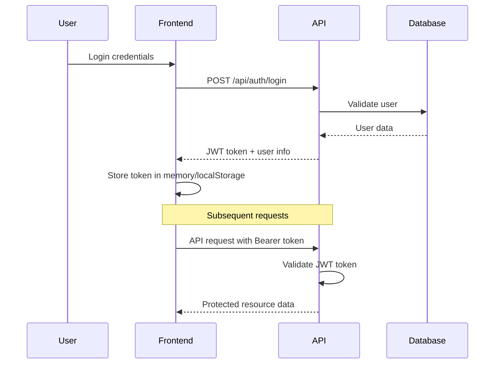
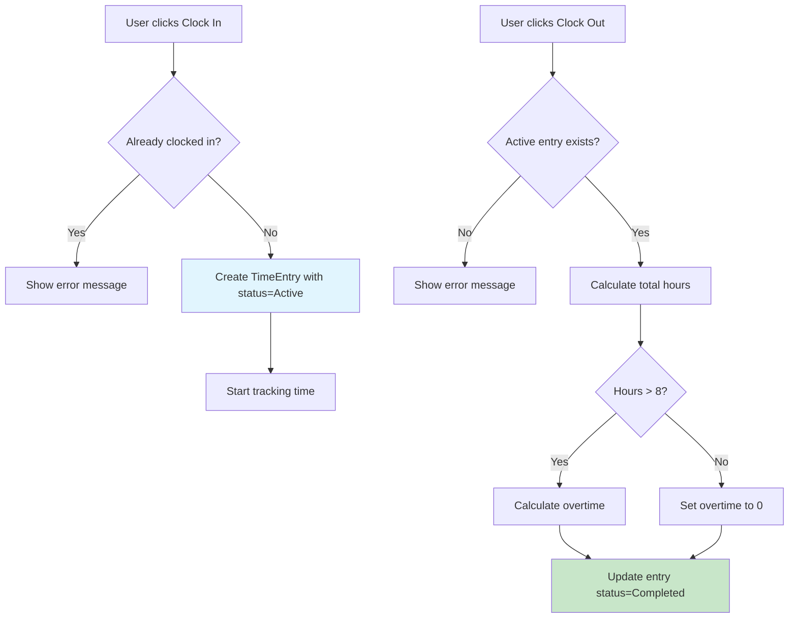

# Oxigin Attendance v2

A comprehensive, full-stack time and attendance management system designed for modern workplaces. Built with cutting-edge technologies to provide seamless employee time tracking, management reporting, and administrative controls.

## 🌟 Overview

Oxigin Attendance v2 is a robust solution that enables organizations to efficiently track employee working hours, manage overtime, generate comprehensive reports, and maintain accurate attendance records. The system supports role-based access control with distinct interfaces for employees, managers, and administrators.

## 🚀 Tech Stack

- **Backend**: .NET 8.0 Web API with Entity Framework Core
- **Database**: PostgreSQL (robust, scalable relational database)
- **Frontend**: React 19 with TypeScript for type safety
- **State Management**: Redux Toolkit for predictable state management
- **UI Framework**: Material-UI (MUI) v7 with Tailwind CSS
- **Authentication**: JWT Bearer tokens with role-based authorization
- **API Documentation**: Swagger/OpenAPI integration
- **Development**: Hot reload, TypeScript support, ESLint

## 🎯 Key Use Cases

### For Employees
- **Daily Time Tracking**: Clock in/out with a single click
- **Break Management**: Track break times automatically or manually
- **Location Tracking**: Optional location logging for remote/field work
- **Personal Reports**: View individual time reports and work history
- **Notes & Context**: Add notes to time entries for project tracking

### For Managers
- **Team Oversight**: Monitor team attendance and working hours
- **Report Generation**: Access comprehensive reports for team members
- **Time Entry Management**: Create, edit, or delete team member time entries
- **Overtime Monitoring**: Track and manage employee overtime
- **Period Analysis**: Generate reports for specific date ranges

### For Administrators
- **System Management**: Full access to all system features
- **User Management**: Create, modify, and deactivate user accounts
- **Role Assignment**: Assign and manage user roles and permissions
- **System Reports**: Access organization-wide attendance analytics
- **Data Maintenance**: Bulk operations and system configuration

## ✅ Features

### Core Functionality
- ✅ **User Authentication**: Secure login/register with JWT tokens
- ✅ **Role-Based Access Control**: Employee, Manager, Administrator roles
- ✅ **Real-Time Clock Interface**: Live clock display with time zone support
- ✅ **One-Click Time Tracking**: Simple clock in/out functionality
- ✅ **Automatic Calculations**: Total hours, break time, and overtime
- ✅ **Responsive Design**: Mobile-friendly Material-UI interface
- ✅ **PostgreSQL Integration**: Robust data persistence and relationships
- ✅ **API Documentation**: Comprehensive Swagger documentation

### Time Management Features
- ✅ **Active Session Tracking**: Monitor current clocked-in status
- ✅ **Break Time Management**: Track and calculate break periods
- ✅ **Overtime Calculation**: Automatic overtime detection (8+ hours/day)
- ✅ **Location Logging**: Optional location tracking for entries
- ✅ **Notes & Comments**: Add context to time entries
- ✅ **Status Management**: Active, Completed, Cancelled entry states
- ✅ **Historical Tracking**: Complete audit trail of time entries

### Reporting & Analytics
- ✅ **Personal Reports**: Individual employee time summaries
- ✅ **Management Reports**: Team and organization-wide analytics
- ✅ **Date Range Filtering**: Flexible report period selection
- ✅ **Detailed Breakdowns**: Total hours, overtime, and days worked
- ✅ **Real-Time Data**: Live updates and current status displays

## 📖 User Workflows

### Employee Daily Workflow

#### 1. Starting Your Work Day
```
1. Login to the system
2. Navigate to the Dashboard
3. Click "Clock In" button
4. Optionally add location or notes
5. Confirm clock-in
```

#### 2. During Work Hours
```
- View real-time work duration
- Monitor break time accumulation
- Add notes to current session if needed
- View current session status
```

#### 3. Ending Your Work Day
```
1. Click "Clock Out" button
2. Add total break time (if not tracked automatically)
3. Add end-of-day notes
4. Confirm clock-out
5. Review daily summary
```

#### 4. Viewing Your Time Records
```
1. Access "Time Entries" section
2. Filter by date range
3. View detailed breakdown
4. Generate personal reports
```

### Manager Workflow

#### 1. Team Monitoring
```
1. Login with Manager role
2. Access "All Employees Report"
3. Select date range for analysis
4. Review team attendance patterns
5. Identify overtime and attendance issues
```

#### 2. Managing Team Time Entries
```
1. Navigate to time entry management
2. Search for specific employee
3. Create, edit, or delete entries as needed
4. Add administrative notes
5. Update entry status
```

### Administrator Workflow

#### 1. System Overview
```
1. Login with Administrator role
2. Access system-wide reports
3. Monitor all user activities
4. Review system performance metrics
```

#### 2. User Management
```
1. Create new user accounts
2. Assign appropriate roles
3. Manage user permissions
4. Deactivate/reactivate accounts
```

## 📚 API Documentation

### Authentication Endpoints

#### POST /api/auth/login
**Purpose**: Authenticate user and receive JWT token

**Request Body**:
```json
{
  "email": "user@example.com",
  "password": "Password123"
}
```

**Response**:
```json
{
  "token": "eyJhbGciOiJIUzI1NiIsInR5cCI6IkpXVCJ9...",
  "expiration": "2024-01-01T12:00:00Z",
  "user": {
    "id": "user-id",
    "email": "user@example.com",
    "firstName": "John",
    "lastName": "Doe",
    "employeeId": "EMP001",
    "department": "Engineering",
    "jobTitle": "Software Developer",
    "roles": ["Employee"]
  }
}
```

#### POST /api/auth/register
**Purpose**: Register a new user account

**Request Body**:
```json
{
  "email": "newuser@example.com",
  "password": "Password123",
  "firstName": "Jane",
  "lastName": "Smith",
  "employeeId": "EMP002",
  "department": "Marketing",
  "jobTitle": "Marketing Specialist",
  "hireDate": "2024-01-01"
}
```

#### GET /api/auth/me
**Purpose**: Get current user information
**Authorization**: Bearer token required

**Response**:
```json
{
  "id": "user-id",
  "email": "user@example.com",
  "firstName": "John",
  "lastName": "Doe",
  "employeeId": "EMP001",
  "department": "Engineering",
  "jobTitle": "Software Developer",
  "hireDate": "2023-01-15",
  "isActive": true,
  "roles": ["Employee"]
}
```

### Time Entry Endpoints

#### POST /api/timeentry/clock-in
**Purpose**: Start a new time entry (clock in)
**Authorization**: Bearer token required

**Request Body**:
```json
{
  "notes": "Starting work on project Alpha",
  "location": "Office - Desk 15"
}
```

**Response**:
```json
{
  "id": 123,
  "userId": "user-id",
  "clockInTime": "2024-01-01T09:00:00Z",
  "clockOutTime": null,
  "totalHours": null,
  "breakTime": null,
  "overtimeHours": null,
  "notes": "Starting work on project Alpha",
  "location": "Office - Desk 15",
  "status": 1,
  "createdAt": "2024-01-01T09:00:00Z",
  "updatedAt": "2024-01-01T09:00:00Z"
}
```

#### POST /api/timeentry/clock-out
**Purpose**: End current time entry (clock out)
**Authorization**: Bearer token required

**Request Body**:
```json
{
  "timeEntryId": 123,
  "notes": "Completed daily tasks",
  "breakTime": "01:00:00"
}
```

**Response**:
```json
{
  "id": 123,
  "userId": "user-id",
  "clockInTime": "2024-01-01T09:00:00Z",
  "clockOutTime": "2024-01-01T17:30:00Z",
  "totalHours": "08:30:00",
  "breakTime": "01:00:00",
  "overtimeHours": "00:30:00",
  "notes": "Completed daily tasks",
  "location": "Office - Desk 15",
  "status": 2,
  "createdAt": "2024-01-01T09:00:00Z",
  "updatedAt": "2024-01-01T17:30:00Z"
}
```

#### GET /api/timeentry/active
**Purpose**: Get current active time entry
**Authorization**: Bearer token required

**Response** (if active):
```json
{
  "id": 123,
  "userId": "user-id",
  "clockInTime": "2024-01-01T09:00:00Z",
  "clockOutTime": null,
  "status": 1,
  "notes": "Starting work on project Alpha",
  "location": "Office - Desk 15"
}
```

**Response** (if no active entry):
```json
{
  "message": "No active time entry found"
}
```

#### GET /api/timeentry
**Purpose**: Get time entries with optional filtering
**Authorization**: Bearer token required
**Query Parameters**:
- `startDate` (optional): Filter entries from this date
- `endDate` (optional): Filter entries to this date

**Example Request**: `/api/timeentry?startDate=2024-01-01&endDate=2024-01-31`

**Response**:
```json
[
  {
    "id": 123,
    "userId": "user-id",
    "clockInTime": "2024-01-01T09:00:00Z",
    "clockOutTime": "2024-01-01T17:30:00Z",
    "totalHours": "08:30:00",
    "breakTime": "01:00:00",
    "overtimeHours": "00:30:00",
    "notes": "Completed daily tasks",
    "location": "Office - Desk 15",
    "status": 2,
    "createdAt": "2024-01-01T09:00:00Z",
    "updatedAt": "2024-01-01T17:30:00Z"
  }
]
```

#### GET /api/timeentry/report
**Purpose**: Get time report for current user
**Authorization**: Bearer token required
**Query Parameters**:
- `startDate` (required): Report start date
- `endDate` (required): Report end date

**Response**:
```json
{
  "userId": "user-id",
  "user": {
    "firstName": "John",
    "lastName": "Doe",
    "employeeId": "EMP001"
  },
  "startDate": "2024-01-01T00:00:00Z",
  "endDate": "2024-01-31T23:59:59Z",
  "totalWorkedHours": "160:00:00",
  "totalOvertimeHours": "10:00:00",
  "totalDaysWorked": 22,
  "timeEntries": [...]
}
```

#### GET /api/timeentry/report/all
**Purpose**: Get time reports for all employees (Manager/Admin only)
**Authorization**: Bearer token required (Manager or Administrator role)
**Query Parameters**:
- `startDate` (required): Report start date
- `endDate` (required): Report end date

### Administrative Endpoints (Manager/Admin Only)

#### POST /api/timeentry
**Purpose**: Create time entry for any employee
**Authorization**: Bearer token required (Manager or Administrator role)
**Query Parameters**:
- `userId` (optional): Target user ID (if not provided, creates for current user)

#### PUT /api/timeentry/{id}
**Purpose**: Update existing time entry
**Authorization**: Bearer token required (Manager or Administrator role)

#### DELETE /api/timeentry/{id}
**Purpose**: Delete time entry
**Authorization**: Bearer token required (Manager or Administrator role)

## 🗄️ Database Schema & Models

### ApplicationUser (extends IdentityUser)
**Purpose**: Store user account and employee information
```csharp
public class ApplicationUser : IdentityUser
{
    public string FirstName { get; set; }
    public string LastName { get; set; }
    public string EmployeeId { get; set; }        // Unique employee identifier
    public string Department { get; set; }        // Employee department
    public string JobTitle { get; set; }          // Job position
    public DateTime HireDate { get; set; }        // Employment start date
    public bool IsActive { get; set; }            // Account status
    public DateTime CreatedAt { get; set; }
    public DateTime UpdatedAt { get; set; }
    
    // Navigation properties
    public virtual ICollection<TimeEntry> TimeEntries { get; set; }
    public virtual ICollection<LeaveRequest> LeaveRequests { get; set; }
}
```

### TimeEntry
**Purpose**: Track individual work sessions and time data
```csharp
public class TimeEntry
{
    public int Id { get; set; }
    public string UserId { get; set; }           // Foreign key to ApplicationUser
    public DateTime ClockInTime { get; set; }    // Work session start time
    public DateTime? ClockOutTime { get; set; }  // Work session end time (null if active)
    public TimeSpan? TotalHours { get; set; }    // Calculated total work hours
    public TimeSpan? BreakTime { get; set; }     // Break duration during session
    public TimeSpan? OvertimeHours { get; set; } // Overtime hours (8+ hours)
    public string? Notes { get; set; }           // Session notes/comments
    public string? Location { get; set; }        // Work location
    public TimeEntryStatus Status { get; set; }  // Active, Completed, Cancelled
    public DateTime CreatedAt { get; set; }
    public DateTime UpdatedAt { get; set; }
    
    // Navigation property
    public virtual ApplicationUser User { get; set; }
}

public enum TimeEntryStatus
{
    Active = 1,      // Currently clocked in
    Completed = 2,   // Completed work session
    Cancelled = 3    // Cancelled/voided session
}
```

### LeaveRequest (Model created, API endpoints planned)
**Purpose**: Manage employee leave requests and approvals
```csharp
public class LeaveRequest
{
    public int Id { get; set; }
    public string UserId { get; set; }           // Employee requesting leave
    public LeaveType Type { get; set; }          // Type of leave requested
    public DateTime StartDate { get; set; }      // Leave start date
    public DateTime EndDate { get; set; }        // Leave end date
    public int TotalDays { get; set; }           // Calculated leave days
    public string Reason { get; set; }           // Leave reason/description
    public LeaveStatus Status { get; set; }      // Pending, Approved, Rejected, Cancelled
    public string? ApprovedByUserId { get; set; } // Manager/Admin who approved
    public DateTime? ApprovedAt { get; set; }    // Approval timestamp
    public string? RejectionReason { get; set; } // Reason for rejection
    public DateTime CreatedAt { get; set; }
    public DateTime UpdatedAt { get; set; }
    
    // Navigation properties
    public virtual ApplicationUser User { get; set; }
    public virtual ApplicationUser? ApprovedBy { get; set; }
}

public enum LeaveType
{
    SickLeave = 1,
    VacationLeave = 2,
    PersonalLeave = 3,
    EmergencyLeave = 4,
    MaternityLeave = 5,
    PaternityLeave = 6
}

public enum LeaveStatus
{
    Pending = 1,
    Approved = 2,
    Rejected = 3,
    Cancelled = 4
}
```

### Database Relationships
- **ApplicationUser** → **TimeEntries** (One-to-Many)
- **ApplicationUser** → **LeaveRequests** (One-to-Many)  
- **ApplicationUser** → **ApprovedLeaveRequests** (One-to-Many, as approver)

### Key Business Rules
- **Overtime Calculation**: Automatic overtime when daily hours exceed 8 hours
- **Single Active Session**: Users can only have one active TimeEntry at a time
- **Time Validation**: ClockOutTime must be after ClockInTime
- **Role Permissions**: Only Managers/Admins can modify other users' time entries

## 🚀 Getting Started

### System Requirements
- **.NET 8.0 SDK** or later
- **Node.js 18+** and npm
- **PostgreSQL 13+** database server
- **Git** for version control
- **Visual Studio Code** or **Visual Studio** (recommended)

### Quick Start Guide

#### 1. Repository Setup
```bash
# Clone the repository
git clone https://github.com/frostaura/oxigin-attendance-v2.git
cd oxigin-attendance-v2
```

#### 2. Database Setup

**Install PostgreSQL** (if not already installed):
- Windows: Download from [PostgreSQL.org](https://www.postgresql.org/download/)
- macOS: `brew install postgresql`
- Linux: `sudo apt-get install postgresql postgresql-contrib`

**Create Database**:
```sql
-- Connect to PostgreSQL as superuser
psql -U postgres

-- Create database and user
CREATE DATABASE oxigin_attendance;
CREATE USER oxigin_user WITH ENCRYPTED PASSWORD 'your_secure_password';
GRANT ALL PRIVILEGES ON DATABASE oxigin_attendance TO oxigin_user;

-- Grant additional permissions for Entity Framework
ALTER USER oxigin_user CREATEDB;
\q
```

#### 3. Backend Configuration

```bash
# Navigate to backend directory
cd backend/OxiginAttendance.Api

# Install dependencies
dotnet restore

# Update connection string in appsettings.json
```

**Configure `appsettings.json`**:
```json
{
  "ConnectionStrings": {
    "DefaultConnection": "Host=localhost;Database=oxigin_attendance;Username=oxigin_user;Password=your_secure_password"
  },
  "Jwt": {
    "Key": "your-super-secret-jwt-key-at-least-32-characters-long",
    "Issuer": "OxiginAttendanceApi",
    "Audience": "OxiginAttendanceClient",
    "ExpireDays": 7
  },
  "Logging": {
    "LogLevel": {
      "Default": "Information",
      "Microsoft.AspNetCore": "Warning"
    }
  },
  "AllowedHosts": "*"
}
```

**Apply Database Migrations**:
```bash
# Install Entity Framework tools (if not already installed)
dotnet tool install --global dotnet-ef

# Create and apply migrations
dotnet ef migrations add InitialCreate
dotnet ef database update
```

**Start Backend Server**:
```bash
dotnet run
```
✅ Backend will be running at: `https://localhost:7017`  
✅ Swagger documentation: `https://localhost:7017/swagger`

#### 4. Frontend Configuration

```bash
# Navigate to frontend directory  
cd frontend

# Install dependencies
npm install

# Create environment configuration
cp .env.example .env.local  # Create if doesn't exist
```

**Configure `.env.local`**:
```env
REACT_APP_API_URL=https://localhost:7017/api
REACT_APP_APP_NAME=Oxigin Attendance v2
```

**Start Frontend Development Server**:
```bash
npm start
```
✅ Frontend will be running at: `http://localhost:3000`

#### 5. Initial Login

The system creates a default administrator account on first run:

**Default Admin Credentials**:
- **Email**: `admin@oxigin.com`
- **Password**: `Admin@123`

⚠️ **Important**: Change the default password immediately in production!

### Development Workflow

#### Daily Development
```bash
# Terminal 1 - Backend
cd backend/OxiginAttendance.Api
dotnet watch run

# Terminal 2 - Frontend  
cd frontend
npm start
```

#### Database Operations
```bash
# Add new migration
dotnet ef migrations add MigrationName

# Update database with latest migrations
dotnet ef database update

# Rollback to specific migration
dotnet ef database update PreviousMigrationName

# Drop database (development only)
dotnet ef database drop
```

#### Code Quality
```bash
# Frontend linting and formatting
cd frontend
npm run lint
npm run format

# Backend code analysis
cd backend/OxiginAttendance.Api
dotnet format
dotnet build --verbosity normal
```

## 📁 Project Architecture

### Backend Structure
```
backend/OxiginAttendance.Api/
├── Controllers/              # API controllers handling HTTP requests
│   ├── AuthController.cs    # Authentication endpoints
│   └── TimeEntryController.cs # Time tracking endpoints
├── Data/                    # Entity Framework DbContext and configurations
│   ├── ApplicationDbContext.cs
│   └── Configurations/      # Entity configurations
├── DTOs/                    # Data Transfer Objects for API communication
│   ├── AuthDto.cs          # Authentication-related DTOs
│   └── TimeEntryDto.cs     # Time entry DTOs
├── Models/                  # Domain models and entities
│   ├── ApplicationUser.cs  # User entity
│   ├── TimeEntry.cs        # Time entry entity
│   └── LeaveRequest.cs     # Leave request entity (future feature)
├── Services/                # Business logic services
│   ├── IAuthService.cs     # Authentication service interface
│   ├── AuthService.cs      # Authentication implementation
│   ├── ITimeEntryService.cs # Time entry service interface
│   └── TimeEntryService.cs # Time entry implementation
├── Migrations/              # Entity Framework migrations
├── Properties/              # Project properties and launch settings
├── Program.cs              # Application startup and configuration
├── appsettings.json        # Application configuration
└── OxiginAttendance.Api.csproj # Project file
```

### Frontend Structure
```
frontend/src/
├── components/              # React components organized by feature
│   ├── auth/               # Authentication components
│   │   ├── Login.tsx       # Login form component
│   │   └── Register.tsx    # Registration form component
│   ├── dashboard/          # Main dashboard components
│   │   └── Dashboard.tsx   # Main dashboard with time tracking
│   ├── layout/             # Layout and navigation components
│   │   ├── Header.tsx      # Application header
│   │   ├── Sidebar.tsx     # Navigation sidebar
│   │   └── Layout.tsx      # Main layout wrapper
│   └── common/             # Shared/reusable components
│       ├── LoadingSpinner.tsx
│       └── ErrorBoundary.tsx
├── store/                  # Redux store and state management
│   ├── index.ts           # Store configuration
│   ├── authSlice.ts       # Authentication state slice
│   └── timeEntrySlice.ts  # Time entry state slice
├── services/               # API client services
│   ├── api.ts             # Base API configuration
│   ├── authService.ts     # Authentication API calls
│   └── timeEntryService.ts # Time entry API calls
├── types/                  # TypeScript type definitions
│   ├── auth.ts            # Authentication types
│   ├── timeEntry.ts       # Time entry types
│   └── api.ts             # API response types
├── utils/                  # Utility functions
│   ├── dateTime.ts        # Date/time formatting utilities
│   ├── validation.ts      # Form validation helpers
│   └── hooks.ts           # Custom React hooks
├── ui/                     # UI components and styling
│   ├── index.ts           # Component exports
│   └── components/        # Custom UI components
├── App.tsx                 # Main application component
├── App.css                # Global styles
├── index.tsx              # Application entry point
└── package.json           # Dependencies and scripts
```

### Key Architectural Patterns

#### Backend Architecture
- **Clean Architecture**: Separation of concerns with Controllers, Services, and Data layers
- **Repository Pattern**: Entity Framework provides repository-like functionality
- **Dependency Injection**: Built-in .NET DI container for service registration
- **JWT Authentication**: Stateless token-based authentication
- **API-First Design**: RESTful API with comprehensive documentation

#### Frontend Architecture  
- **Component-Based**: Modular React components with single responsibilities
- **State Management**: Redux Toolkit for predictable state management
- **Type Safety**: Full TypeScript implementation with strict type checking
- **Custom Hooks**: Reusable logic encapsulation
- **API Layer**: Centralized API communication with error handling

#### Data Flow
1. **Frontend Request**: User interacts with React components
2. **State Management**: Actions dispatched to Redux store
3. **API Service**: HTTP requests sent to backend API
4. **Controller**: API endpoints receive and validate requests
5. **Service Layer**: Business logic processing
6. **Data Access**: Entity Framework queries database
7. **Response**: Data flows back through the same layers

## ⚙️ System Configuration

### Environment Variables

#### Backend Configuration (`appsettings.json`)
```json
{
  "ConnectionStrings": {
    "DefaultConnection": "Host=localhost;Database=oxigin_attendance;Username=your_user;Password=your_password"
  },
  "Jwt": {
    "Key": "your-super-secret-jwt-key-minimum-32-characters",
    "Issuer": "OxiginAttendanceApi",
    "Audience": "OxiginAttendanceClient", 
    "ExpireDays": 7
  },
  "TimeEntry": {
    "StandardWorkDayHours": 8,        // Hours before overtime
    "MaxDailyHours": 24,             // Maximum hours per day
    "AllowBackdatedEntries": true,    // Allow creating past entries
    "RequireLocation": false          // Require location for clock in/out
  },
  "Logging": {
    "LogLevel": {
      "Default": "Information",
      "Microsoft.AspNetCore": "Warning",
      "Microsoft.EntityFrameworkCore": "Warning"
    }
  }
}
```

#### Frontend Configuration (`.env`)
```env
# API Configuration
REACT_APP_API_URL=https://localhost:7017/api
REACT_APP_API_TIMEOUT=30000

# Application Settings  
REACT_APP_APP_NAME=Oxigin Attendance v2
REACT_APP_VERSION=2.0.0
REACT_APP_COMPANY_NAME=Your Company Name

# Feature Flags
REACT_APP_ENABLE_LOCATION_TRACKING=true
REACT_APP_ENABLE_BREAK_TRACKING=true
REACT_APP_DEFAULT_TIMEZONE=America/New_York

# UI Configuration
REACT_APP_THEME_PRIMARY_COLOR=#1976d2
REACT_APP_ITEMS_PER_PAGE=10
```

### Security Configuration

#### JWT Token Settings
- **Key Length**: Minimum 32 characters for HMAC-SHA256
- **Expiration**: Configurable (default: 7 days)
- **Refresh**: Tokens expire and require re-authentication
- **Claims**: User ID, email, roles, and employee ID

#### Role-Based Permissions
```csharp
// Employee permissions
- View own time entries
- Clock in/out
- View personal reports
- Update own profile

// Manager permissions (includes Employee permissions)
- View team time entries
- Create/edit/delete team time entries
- Generate team reports
- View team member profiles

// Administrator permissions (includes all permissions)
- Full system access
- User management
- System configuration
- Organization-wide reports
```

### Database Configuration

#### PostgreSQL Optimization
```sql
-- Recommended PostgreSQL settings for production
-- postgresql.conf adjustments

# Connection settings
max_connections = 100
shared_buffers = 256MB
effective_cache_size = 1GB

# Performance settings
work_mem = 4MB
maintenance_work_mem = 64MB
checkpoint_completion_target = 0.9
wal_buffers = 16MB

# Logging (for development)
log_statement = 'mod'
log_duration = on
log_min_duration_statement = 1000
```

#### Backup Strategy
```bash
# Daily backup script
#!/bin/bash
DATE=$(date +%Y%m%d_%H%M%S)
BACKUP_DIR="/backup/oxigin-attendance"
DB_NAME="oxigin_attendance"

mkdir -p $BACKUP_DIR

pg_dump -h localhost -U oxigin_user -d $DB_NAME > $BACKUP_DIR/backup_$DATE.sql

# Keep only last 30 days of backups
find $BACKUP_DIR -name "backup_*.sql" -mtime +30 -delete
```

## 🔧 Development Notes

### Authentication Flow


### Time Tracking Logic


### Business Rules Implementation

#### Overtime Calculation
```csharp
public TimeSpan CalculateOvertimeHours(TimeSpan totalHours, TimeSpan? breakTime = null)
{
    var standardWorkDay = TimeSpan.FromHours(8);
    var effectiveHours = totalHours - (breakTime ?? TimeSpan.Zero);
    
    return effectiveHours > standardWorkDay 
        ? effectiveHours - standardWorkDay 
        : TimeSpan.Zero;
}
```

#### Break Time Management
- **Automatic Tracking**: System can automatically calculate break time
- **Manual Entry**: Users can manually specify break duration
- **Validation**: Break time cannot exceed total work time
- **Business Rule**: Breaks are subtracted from total hours for overtime calculation

#### Time Entry Validation
```csharp
public class TimeEntryValidator
{
    public ValidationResult ValidateTimeEntry(TimeEntryCreateDto dto)
    {
        var errors = new List<string>();
        
        // Clock out must be after clock in
        if (dto.ClockOutTime.HasValue && dto.ClockOutTime <= dto.ClockInTime)
            errors.Add("Clock out time must be after clock in time");
            
        // Maximum 24 hours per entry  
        if (dto.ClockOutTime.HasValue)
        {
            var duration = dto.ClockOutTime.Value - dto.ClockInTime;
            if (duration > TimeSpan.FromHours(24))
                errors.Add("Time entry cannot exceed 24 hours");
        }
        
        // Break time validation
        if (dto.BreakTime.HasValue && dto.ClockOutTime.HasValue)
        {
            var totalTime = dto.ClockOutTime.Value - dto.ClockInTime;
            if (dto.BreakTime > totalTime)
                errors.Add("Break time cannot exceed total work time");
        }
        
        return new ValidationResult { IsValid = !errors.Any(), Errors = errors };
    }
}
```

### Role-Based Access Implementation
```csharp
// Attribute-based authorization
[HttpGet("report/all")]
[Authorize(Roles = "Manager,Administrator")]
public async Task<ActionResult<List<TimeReportDto>>> GetAllEmployeesTimeReport()
{
    // Implementation
}

// Policy-based authorization (future enhancement)
public class TimeEntryAuthorizationHandler : AuthorizationHandler<TimeEntryRequirement>
{
    protected override Task HandleRequirementAsync(
        AuthorizationHandlerContext context,
        TimeEntryRequirement requirement)
    {
        // Custom authorization logic
        return Task.CompletedTask;
    }
}
```

## 🔮 Future Enhancements

### Planned Features
- [ ] **Leave Request Management System**
  - Employee leave request submission
  - Manager approval workflow
  - Leave balance tracking
  - Calendar integration
  - Email notifications for requests

- [ ] **Advanced Reporting & Analytics**
  - Interactive charts and graphs
  - Attendance trend analysis
  - Productivity metrics
  - Export to PDF/Excel formats
  - Scheduled report generation

- [ ] **Employee Management Interface**
  - Employee directory
  - Bulk user operations
  - Department/team management
  - Employee profile management
  - Organizational hierarchy

- [ ] **Enhanced Time Tracking**
  - Project/task-based time tracking
  - Bulk time entry operations
  - Time tracking templates
  - Geolocation-based clock in/out
  - Mobile app support

- [ ] **Notification System**
  - Real-time browser notifications
  - Email notifications
  - SMS alerts (optional)
  - Slack/Teams integration
  - Custom notification rules

- [ ] **Advanced Features**
  - Audit trail and activity logging
  - Advanced filtering and search
  - Custom fields for time entries
  - Multi-language support
  - Dark/light theme toggle

### Technical Improvements
- [ ] **Testing Infrastructure**
  - Unit test coverage (backend)
  - Integration tests
  - End-to-end tests with Playwright
  - Performance testing
  - API testing suite

- [ ] **DevOps & Deployment**
  - Docker containerization
  - CI/CD pipeline setup (GitHub Actions)
  - Database migration management
  - Environment-specific configurations
  - Kubernetes deployment manifests

- [ ] **Performance & Security**
  - API response caching
  - Database query optimization
  - Rate limiting implementation
  - Security audit compliance
  - OWASP security guidelines

- [ ] **Monitoring & Observability**
  - Application performance monitoring
  - Structured logging with Serilog
  - Health check endpoints
  - Metrics and alerting
  - Error tracking integration

## 🧪 Testing

### Running Tests

#### Backend Tests
```bash
cd backend/OxiginAttendance.Api

# Run all tests
dotnet test

# Run tests with coverage
dotnet test --collect:"XPlat Code Coverage"

# Run specific test project
dotnet test Tests/OxiginAttendance.Tests.csproj
```

#### Frontend Tests
```bash
cd frontend

# Run unit tests
npm test

# Run tests in watch mode
npm run test:watch

# Run tests with coverage
npm run test:coverage

# Run end-to-end tests
npm run test:e2e
```

### Test Structure

#### Backend Test Categories
```
Tests/
├── Unit/                    # Unit tests for individual components
│   ├── Services/           # Service layer tests
│   ├── Controllers/        # Controller tests  
│   └── Models/             # Model validation tests
├── Integration/            # Integration tests
│   ├── Api/               # API endpoint tests
│   └── Database/          # Database integration tests
└── TestFixtures/          # Shared test data and utilities
```

#### Frontend Test Categories
```
src/
├── components/
│   └── __tests__/         # Component unit tests
├── services/
│   └── __tests__/         # Service layer tests
├── store/
│   └── __tests__/         # Redux store tests
└── utils/
    └── __tests__/         # Utility function tests
```

### Test Data Setup
```csharp
// Backend test data factory
public class TestDataFactory
{
    public static ApplicationUser CreateTestUser(string role = "Employee")
    {
        return new ApplicationUser
        {
            Id = Guid.NewGuid().ToString(),
            Email = "test@example.com",
            FirstName = "Test",
            LastName = "User",
            EmployeeId = "TEST001",
            Department = "Engineering",
            JobTitle = "Software Developer",
            IsActive = true
        };
    }
    
    public static TimeEntry CreateTestTimeEntry(string userId)
    {
        return new TimeEntry
        {
            UserId = userId,
            ClockInTime = DateTime.UtcNow.AddHours(-8),
            ClockOutTime = DateTime.UtcNow,
            Status = TimeEntryStatus.Completed
        };
    }
}
```

## 🐛 Troubleshooting

### Common Issues and Solutions

#### Backend Issues

**Issue**: Database connection fails
```
Error: Unable to connect to PostgreSQL server
```
**Solutions**:
1. Verify PostgreSQL service is running:
   ```bash
   # Windows
   net start postgresql-x64-13
   
   # macOS
   brew services start postgresql
   
   # Linux
   sudo systemctl start postgresql
   ```
2. Check connection string in `appsettings.json`
3. Verify database and user exist:
   ```sql
   \l                          -- List databases
   \du                         -- List users
   ```
4. Test connection manually:
   ```bash
   psql -h localhost -U oxigin_user -d oxigin_attendance
   ```

**Issue**: JWT token validation fails
```
Error: 401 Unauthorized - Invalid token
```
**Solutions**:
1. Check JWT configuration in `appsettings.json`
2. Ensure JWT key is at least 32 characters
3. Verify token hasn't expired
4. Check frontend is sending token in Authorization header:
   ```javascript
   headers: { 'Authorization': `Bearer ${token}` }
   ```

**Issue**: Entity Framework migration errors
```
Error: A migration with the name 'InitialCreate' already exists
```
**Solutions**:
```bash
# Remove existing migration
dotnet ef migrations remove

# Clear database and start fresh (development only)
dotnet ef database drop
dotnet ef migrations add InitialCreate
dotnet ef database update
```

#### Frontend Issues

**Issue**: API requests failing with CORS errors
```
Error: CORS policy blocked the request
```
**Solutions**:
1. Ensure backend CORS is configured in `Program.cs`:
   ```csharp
   builder.Services.AddCors(options =>
   {
       options.AddPolicy("AllowFrontend", policy =>
       {
           policy.WithOrigins("http://localhost:3000")
                 .AllowAnyHeader()
                 .AllowAnyMethod();
       });
   });
   ```

**Issue**: Environment variables not loading
```
Error: REACT_APP_API_URL is undefined
```
**Solutions**:
1. Ensure `.env` file is in frontend root directory
2. Restart development server after changing `.env`
3. Variables must start with `REACT_APP_`
4. Check for typos in variable names

**Issue**: Build fails with TypeScript errors
```
Error: Type 'string | undefined' is not assignable to type 'string'
```
**Solutions**:
1. Add proper type guards:
   ```typescript
   const apiUrl = process.env.REACT_APP_API_URL;
   if (!apiUrl) throw new Error('API URL not configured');
   ```
2. Use optional chaining: `user?.firstName`
3. Provide default values: `user.firstName || 'Unknown'`

#### Performance Issues

**Issue**: Slow API responses
**Solutions**:
1. Check database query performance:
   ```sql
   EXPLAIN ANALYZE SELECT * FROM "TimeEntries" WHERE "UserId" = 'user-id';
   ```
2. Add database indexes:
   ```csharp
   modelBuilder.Entity<TimeEntry>()
       .HasIndex(t => t.UserId);
   ```
3. Implement pagination for large datasets
4. Use projection to select only needed fields

**Issue**: Frontend performance degradation
**Solutions**:
1. Use React.memo for component optimization
2. Implement proper key props in lists
3. Use lazy loading for routes:
   ```typescript
   const Dashboard = lazy(() => import('./Dashboard'));
   ```
4. Profile with React Developer Tools

### Debug Configuration

#### Backend Debugging (VS Code)
```json
// .vscode/launch.json
{
  "version": "0.2.0",
  "configurations": [
    {
      "name": ".NET Core Launch (web)",
      "type": "coreclr",
      "request": "launch",
      "preLaunchTask": "build",
      "program": "${workspaceFolder}/backend/OxiginAttendance.Api/bin/Debug/net8.0/OxiginAttendance.Api.dll",
      "args": [],
      "cwd": "${workspaceFolder}/backend/OxiginAttendance.Api",
      "env": {
        "ASPNETCORE_ENVIRONMENT": "Development"
      },
      "sourceFileMap": {
        "/Views": "${workspaceFolder}/Views"
      }
    }
  ]
}
```

#### Frontend Debugging
1. Install React Developer Tools browser extension
2. Use Redux DevTools extension
3. Enable source maps in development
4. Use browser debugger with breakpoints

### Logging Configuration

#### Backend Logging
```csharp
// Program.cs
builder.Logging.ClearProviders();
builder.Logging.AddConsole();
builder.Logging.AddDebug();

// In production, consider Serilog
Log.Logger = new LoggerConfiguration()
    .WriteTo.Console()
    .WriteTo.File("logs/app.log", rollingInterval: RollingInterval.Day)
    .CreateLogger();
```

#### Frontend Logging
```typescript
// utils/logger.ts
export const logger = {
  info: (message: string, data?: any) => {
    if (process.env.NODE_ENV === 'development') {
      console.log(`[INFO] ${message}`, data);
    }
  },
  error: (message: string, error?: any) => {
    console.error(`[ERROR] ${message}`, error);
    // In production, send to error tracking service
  }
};
```

## 🚀 Deployment

### Production Deployment

#### Environment Setup
```bash
# Production environment variables
ASPNETCORE_ENVIRONMENT=Production
ConnectionStrings__DefaultConnection="Host=prod-db;Database=oxigin_attendance;Username=prod_user;Password=secure_password"
Jwt__Key="production-super-secret-jwt-key-minimum-32-characters"
```

#### Database Migration for Production
```bash
# Generate SQL script for production deployment
dotnet ef migrations script --output migration.sql

# Apply in production database
psql -h prod-db -U prod_user -d oxigin_attendance -f migration.sql
```

#### Docker Deployment
```dockerfile
# Dockerfile.backend
FROM mcr.microsoft.com/dotnet/aspnet:8.0 AS base
WORKDIR /app
EXPOSE 80
EXPOSE 443

FROM mcr.microsoft.com/dotnet/sdk:8.0 AS build
WORKDIR /src
COPY ["OxiginAttendance.Api.csproj", "."]
RUN dotnet restore
COPY . .
RUN dotnet build -c Release -o /app/build

FROM build AS publish
RUN dotnet publish -c Release -o /app/publish

FROM base AS final
WORKDIR /app
COPY --from=publish /app/publish .
ENTRYPOINT ["dotnet", "OxiginAttendance.Api.dll"]
```

```dockerfile
# Dockerfile.frontend  
FROM node:18-alpine AS build
WORKDIR /app
COPY package*.json ./
RUN npm ci --only=production
COPY . .
RUN npm run build

FROM nginx:alpine
COPY --from=build /app/build /usr/share/nginx/html
COPY nginx.conf /etc/nginx/nginx.conf
EXPOSE 80
CMD ["nginx", "-g", "daemon off;"]
```

#### Docker Compose
```yaml
# docker-compose.prod.yml
version: '3.8'
services:
  postgres:
    image: postgres:15
    environment:
      POSTGRES_DB: oxigin_attendance
      POSTGRES_USER: oxigin_user
      POSTGRES_PASSWORD: ${DB_PASSWORD}
    volumes:
      - postgres_data:/var/lib/postgresql/data
    ports:
      - "5432:5432"

  backend:
    build:
      context: ./backend/OxiginAttendance.Api
      dockerfile: Dockerfile
    environment:
      ASPNETCORE_ENVIRONMENT: Production
      ConnectionStrings__DefaultConnection: "Host=postgres;Database=oxigin_attendance;Username=oxigin_user;Password=${DB_PASSWORD}"
    depends_on:
      - postgres
    ports:
      - "5000:80"

  frontend:
    build:
      context: ./frontend
      dockerfile: Dockerfile
    ports:
      - "3000:80"
    depends_on:
      - backend

volumes:
  postgres_data:
```

### Performance Optimization

#### Database Optimization
```sql
-- Create indexes for better query performance
CREATE INDEX idx_timeentry_userid ON "TimeEntries"("UserId");
CREATE INDEX idx_timeentry_clockin ON "TimeEntries"("ClockInTime");
CREATE INDEX idx_timeentry_status ON "TimeEntries"("Status");
CREATE INDEX idx_user_employeeid ON "AspNetUsers"("EmployeeId");
```

#### API Optimization
```csharp
// Response caching
[HttpGet]
[ResponseCache(Duration = 300)] // Cache for 5 minutes
public async Task<ActionResult<List<TimeReportDto>>> GetTimeReport()
{
    // Implementation
}

// Compression
public void ConfigureServices(IServiceCollection services)
{
    services.AddResponseCompression();
    services.Configure<GzipCompressionProviderOptions>(options =>
    {
        options.Level = CompressionLevel.Optimal;
    });
}
```

## 📊 Monitoring and Maintenance

### Health Checks
```csharp
// Program.cs
builder.Services.AddHealthChecks()
    .AddNpgSql(builder.Configuration.GetConnectionString("DefaultConnection"))
    .AddCheck("api", () => HealthCheckResult.Healthy());

app.MapHealthChecks("/health", new HealthCheckOptions
{
    ResponseWriter = UIResponseWriter.WriteHealthCheckUIResponse
});
```

### Logging Strategy
```csharp
// Structured logging with Serilog
public static void Main(string[] args)
{
    Log.Logger = new LoggerConfiguration()
        .ReadFrom.Configuration(configuration)
        .Enrich.FromLogContext()
        .WriteTo.Console()
        .WriteTo.File("logs/app-.log", rollingInterval: RollingInterval.Day)
        .CreateLogger();
    
    try
    {
        Log.Information("Starting up");
        CreateHostBuilder(args).Build().Run();
    }
    catch (Exception ex)
    {
        Log.Fatal(ex, "Application start-up failed");
    }
    finally
    {
        Log.CloseAndFlush();
    }
}
```

### Backup and Recovery
```bash
#!/bin/bash
# Daily backup script
DATE=$(date +%Y%m%d_%H%M%S)
BACKUP_DIR="/backup/oxigin-attendance"
DB_NAME="oxigin_attendance"

# Create backup directory
mkdir -p $BACKUP_DIR

# Database backup
pg_dump -h localhost -U oxigin_user -d $DB_NAME | gzip > $BACKUP_DIR/db_backup_$DATE.sql.gz

# Application files backup (if needed)
tar -czf $BACKUP_DIR/app_backup_$DATE.tar.gz /path/to/application

# Retention policy - keep last 30 days
find $BACKUP_DIR -name "*.gz" -mtime +30 -delete

# Upload to cloud storage (optional)
aws s3 sync $BACKUP_DIR s3://your-backup-bucket/oxigin-attendance/
```

## 🤝 Contributing

We welcome contributions to the Oxigin Attendance v2 project! Please follow these guidelines:

### Development Process
1. **Fork the repository** from the main branch
2. **Create a feature branch** with a descriptive name:
   ```bash
   git checkout -b feature/add-leave-management
   git checkout -b bugfix/fix-overtime-calculation
   git checkout -b docs/update-api-documentation
   ```
3. **Make your changes** following the coding standards
4. **Write or update tests** for your changes
5. **Test thoroughly** in development environment
6. **Update documentation** if needed
7. **Commit your changes** with clear commit messages:
   ```bash
   git commit -m "feat: add leave request management system
   
   - Add LeaveRequest model and database migration
   - Implement CRUD operations for leave requests
   - Add leave approval workflow
   - Update API documentation"
   ```
8. **Create a pull request** with detailed description

### Coding Standards

#### Backend (.NET)
- Follow Microsoft C# Coding Conventions
- Use meaningful variable and method names
- Add XML documentation for public APIs:
  ```csharp
  /// <summary>
  /// Calculates overtime hours for a given time entry
  /// </summary>
  /// <param name="totalHours">Total hours worked</param>
  /// <param name="breakTime">Break time to subtract</param>
  /// <returns>Overtime hours if applicable</returns>
  public TimeSpan CalculateOvertimeHours(TimeSpan totalHours, TimeSpan? breakTime = null)
  ```
- Use async/await for asynchronous operations
- Implement proper error handling and logging

#### Frontend (React/TypeScript)
- Follow React and TypeScript best practices
- Use functional components with hooks
- Implement proper TypeScript typing:
  ```typescript
  interface TimeEntryProps {
    entry: TimeEntryDto;
    onEdit: (id: number) => void;
    onDelete: (id: number) => Promise<void>;
  }
  ```
- Use meaningful component and variable names
- Follow Material-UI component patterns

#### Database
- Use descriptive table and column names
- Follow PostgreSQL naming conventions (snake_case)
- Add appropriate indexes for performance
- Include migration scripts for schema changes

### Testing Requirements
- **Unit Tests**: All new business logic must have unit tests
- **Integration Tests**: API endpoints should have integration tests
- **Frontend Tests**: Components should have unit tests
- **Test Coverage**: Aim for 80% or higher code coverage

### Code Review Process
1. All changes require review from at least one maintainer
2. Automated tests must pass
3. No merge conflicts with main branch
4. Documentation must be updated if applicable
5. Security considerations must be addressed

### Issue Reporting
When reporting issues, please include:
- **Environment**: OS, browser, .NET version, Node version
- **Steps to reproduce** the issue
- **Expected behavior** vs **actual behavior**
- **Screenshots** if applicable
- **Error messages** and stack traces

### Feature Requests
For new features, please:
1. **Check existing issues** to avoid duplicates
2. **Provide detailed description** of the feature
3. **Explain the use case** and business value
4. **Consider implementation approach**
5. **Be willing to contribute** to the implementation

## 📄 License

This project is licensed under the **MIT License**.

```
MIT License

Copyright (c) 2024 Oxigin Attendance v2

Permission is hereby granted, free of charge, to any person obtaining a copy
of this software and associated documentation files (the "Software"), to deal
in the Software without restriction, including without limitation the rights
to use, copy, modify, merge, publish, distribute, sublicense, and/or sell
copies of the Software, and to permit persons to whom the Software is
furnished to do so, subject to the following conditions:

The above copyright notice and this permission notice shall be included in all
copies or substantial portions of the Software.

THE SOFTWARE IS PROVIDED "AS IS", WITHOUT WARRANTY OF ANY KIND, EXPRESS OR
IMPLIED, INCLUDING BUT NOT LIMITED TO THE WARRANTIES OF MERCHANTABILITY,
FITNESS FOR A PARTICULAR PURPOSE AND NONINFRINGEMENT. IN NO EVENT SHALL THE
AUTHORS OR COPYRIGHT HOLDERS BE LIABLE FOR ANY CLAIM, DAMAGES OR OTHER
LIABILITY, WHETHER IN AN ACTION OF CONTRACT, TORT OR OTHERWISE, ARISING FROM,
OUT OF OR IN CONNECTION WITH THE SOFTWARE OR THE USE OR OTHER DEALINGS IN THE
SOFTWARE.
```

## 📞 Support

For support, questions, or feedback:

- **Issues**: Create an issue on GitHub for bug reports or feature requests
- **Discussions**: Use GitHub Discussions for questions and community support
- **Documentation**: Refer to this README and inline code documentation
- **API Documentation**: Access Swagger UI at `/swagger` when running the backend

---

**Built with ❤️ using modern technologies for efficient time and attendance management.**
